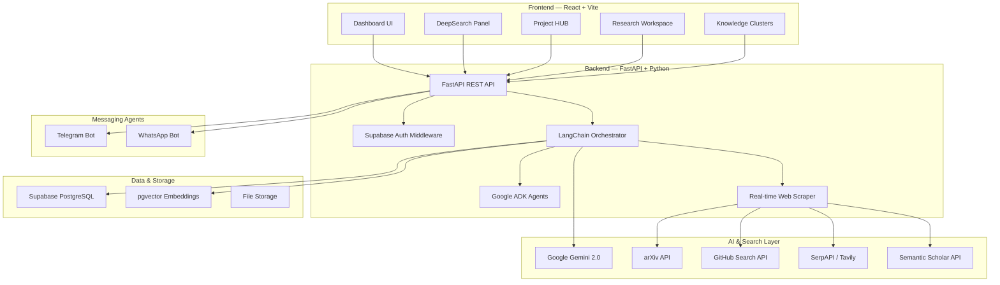

# 🚀 Innovix — AI-Powered Research & Innovation Copilot

**Goal:** Build a full-stack AI copilot that helps students go from a raw idea to an implementation-ready project plan — with deep research, gap analysis, project architecture, and collaborative AI agents — simulating all 7 iNSIGHTS Layer 2 capabilities.

---

## System Architecture Overview



---

## Tech Stack Summary

| Layer | Technology | Purpose |
|---|---|---|
| **Frontend** | React 18 + Vite + TypeScript | SPA with fast HMR |
| **Styling** | Tailwind CSS + Shadcn/UI | Premium, responsive UI |
| **State** | Zustand + React Query | Client state + server cache |
| **Backend** | FastAPI (Python 3.12) | REST API + WebSocket streaming |
| **Auth** | Supabase Auth (OAuth + JWT) | Google/GitHub login |
| **Database** | Supabase PostgreSQL + pgvector | Relational data + vector search |
| **AI/LLM** | Google Gemini 2.0 Flash | DeepSearch, summarization, generation |
| **Orchestration** | LangChain + Google ADK | Multi-agent workflows |
| **Search Sources** | arXiv, GitHub, Semantic Scholar, SerpAPI | Multi-source research |
| **Messaging** | python-telegram-bot, Twilio WhatsApp | AI Agent notifications |
| **Deployment** | Vercel (frontend) + Render (backend) | Production hosting |

---

## iNSIGHTS Layer 2 — Feature Mapping

| Layer 2 Capability | Our Implementation |
|---|---|
| 🔍 **DeepSearch** | Multi-source AI research engine with LangChain agents querying arXiv, GitHub, Semantic Scholar, and web — producing citation-backed summaries |
| 🚀 **Project HUB** | Auto-generated project plans with milestones, architecture diagrams, tech stack, APIs, timelines, and exportable documentation |
| 🤖 **AI Agents** | Telegram + WhatsApp bots for progress tracking, reminders, Q&A, and push notifications |
| 🌐 **Real-time Web Intelligence** | Live web scraping + trending topic detection using SerpAPI/Tavily with freshness scoring |
| 📊 **Personalized Dashboards** | Interactive dashboard with project progress, research insights, recommendations, and analytics charts |
| 🧠 **Knowledge Clustering** | Embedding-based clustering of research results into thematic groups using pgvector + k-means |
| 📚 **Research Workspaces** | Collaborative workspace to save, annotate, organize research, and export to PDF/Markdown |

---

## Phase-Wise Implementation Plan

---

### 📦 Phase 1 — Foundation & Project Scaffolding (Days 1–2)

> Set up the monorepo, configure all tooling, establish database schema, and build the authentication system.

#### [NEW] Monorepo Root Structure
```
d:\Innovix\
├── frontend/          # React + Vite app
│   ├── src/
│   │   ├── components/    # Reusable UI (Shadcn)
│   │   ├── features/      # Feature modules
│   │   ├── hooks/         # Custom React hooks
│   │   ├── lib/           # Utils, API client, types
│   │   ├── pages/         # Route pages
│   │   └── stores/        # Zustand stores
│   ├── public/
│   ├── index.html
│   ├── vite.config.ts
│   ├── tailwind.config.ts
│   ├── tsconfig.json
│   └── package.json
├── backend/           # FastAPI Python app
│   ├── app/
│   │   ├── api/           # Route handlers
│   │   │   ├── auth.py
│   │   │   ├── deepsearch.py
│   │   │   ├── projects.py
│   │   │   ├── workspaces.py
│   │   │   └── agents.py
│   │   ├── core/          # Config, security, deps
│   │   ├── models/        # SQLAlchemy/Pydantic models
│   │   ├── services/      # Business logic
│   │   │   ├── search/        # DeepSearch engine
│   │   │   ├── project_hub/   # Project generation
│   │   │   ├── clustering/    # Knowledge clustering
│   │   │   ├── agents/        # AI agent logic
│   │   │   └── web_intel/     # Real-time web intelligence
│   │   ├── agents/        # Google ADK / LangChain agents
│   │   └── main.py
│   ├── requirements.txt
│   └── .env.example
├── bots/              # Telegram + WhatsApp bots
│   ├── telegram_bot.py
│   └── whatsapp_bot.py
├── supabase/          # DB migrations & seed
│   └── migrations/
├── .gitignore
├── README.md
└── docker-compose.yml
```

#### [NEW] `backend/app/core/config.py` — Environment Configuration
- Pydantic `Settings` class with all env vars (Gemini key, Supabase URL, Telegram token, etc.)
- `.env.example` with all required keys documented

#### [NEW] Supabase Database Schema
```sql
-- Users (managed by Supabase Auth, extended with profiles)
CREATE TABLE profiles (
  id UUID PRIMARY KEY REFERENCES auth.users(id),
  full_name TEXT,
  avatar_url TEXT,
  preferences JSONB DEFAULT '{}',
  created_at TIMESTAMPTZ DEFAULT now()
);

-- Research Projects
CREATE TABLE projects (
  id UUID PRIMARY KEY DEFAULT gen_random_uuid(),
  user_id UUID REFERENCES profiles(id),
  title TEXT NOT NULL,
  idea_text TEXT NOT NULL,
  status TEXT DEFAULT 'ideation',  -- ideation, researching, planning, building, completed
  project_plan JSONB,              -- Full generated plan
  tech_stack JSONB,
  architecture JSONB,
  timeline JSONB,
  created_at TIMESTAMPTZ DEFAULT now(),
  updated_at TIMESTAMPTZ DEFAULT now()
);

-- DeepSearch Results
CREATE TABLE search_results (
  id UUID PRIMARY KEY DEFAULT gen_random_uuid(),
  project_id UUID REFERENCES projects(id) ON DELETE CASCADE,
  query TEXT NOT NULL,
  sources JSONB NOT NULL,          -- [{title, url, snippet, source_type, relevance_score}]
  summary TEXT,
  citations JSONB,
  cluster_id INTEGER,
  embedding VECTOR(768),           -- For pgvector similarity search
  created_at TIMESTAMPTZ DEFAULT now()
);

-- Research Workspaces
CREATE TABLE workspaces (
  id UUID PRIMARY KEY DEFAULT gen_random_uuid(),
  project_id UUID REFERENCES projects(id) ON DELETE CASCADE,
  name TEXT NOT NULL,
  notes JSONB DEFAULT '[]',        -- [{id, content, tags, created_at}]
  saved_results UUID[],            -- Array of search_result IDs
  annotations JSONB DEFAULT '[]',
  created_at TIMESTAMPTZ DEFAULT now()
);

-- Knowledge Clusters
CREATE TABLE clusters (
  id SERIAL PRIMARY KEY,
  project_id UUID REFERENCES projects(id) ON DELETE CASCADE,
  label TEXT NOT NULL,
  keywords TEXT[],
  centroid VECTOR(768),
  result_ids UUID[],
  created_at TIMESTAMPTZ DEFAULT now()
);

-- Agent Conversations (Telegram/WhatsApp)
CREATE TABLE agent_sessions (
  id UUID PRIMARY KEY DEFAULT gen_random_uuid(),
  user_id UUID REFERENCES profiles(id),
  platform TEXT NOT NULL,          -- 'telegram' | 'whatsapp'
  chat_id TEXT NOT NULL,
  project_id UUID REFERENCES projects(id),
  conversation_history JSONB DEFAULT '[]',
  last_active TIMESTAMPTZ DEFAULT now()
);
```

#### [NEW] `backend/app/main.py` — FastAPI App Bootstrap
- CORS middleware for frontend
- Supabase client initialization
- Route registration for all API modules
- WebSocket endpoint for streaming AI responses

#### [NEW] `frontend/` — React + Vite Scaffold
- Vite project with TypeScript + React
- Tailwind CSS + Shadcn/UI setup
- Supabase client for auth
- React Router for navigation
- Zustand store for global state
- API client (Axios) with auth interceptor

#### Verification
- [ ] Frontend runs on `localhost:5173` with Tailwind working
- [ ] Backend runs on `localhost:8000` with `/docs` (Swagger) accessible
- [ ] Supabase auth flow (Google/GitHub OAuth) working end-to-end
- [ ] Database tables created and accessible

---

### 🔍 Phase 2 — DeepSearch Engine (Days 3–5)

> Build the core AI research engine that queries multiple sources, synthesizes results with citations, and streams responses in real-time.

#### [NEW] `backend/app/services/search/deep_search.py`
**Multi-Source Search Orchestrator** using LangChain:
1. **Query Understanding** — Gemini parses the user's idea into structured sub-queries
2. **Parallel Source Fetching:**
   - **arXiv API** → Research papers (title, abstract, authors, PDF link)
   - **GitHub Search API** → Repositories (stars, language, description, README excerpt)
   - **Semantic Scholar API** → Academic papers with citation counts
   - **SerpAPI / Tavily** → Real-time web results (articles, blogs, docs)
3. **Result Fusion** — Deduplicate, rank by relevance score, assign source types
4. **AI Summarization** — Gemini generates a structured summary with inline citations
5. **Gap Analysis** — Gemini identifies what existing solutions lack and recommends innovation areas

#### [NEW] `backend/app/services/search/sources/`
Individual source adapters:
- `arxiv_source.py` — arXiv API client with XML parsing
- `github_source.py` — GitHub REST API search (repos + code)
- `scholar_source.py` — Semantic Scholar API client
- `web_source.py` — SerpAPI/Tavily for general web results

#### [NEW] `backend/app/agents/research_agent.py`
**Google ADK Agent** for autonomous deep research:
- Multi-step reasoning: break idea → generate queries → search → synthesize
- Tool-use pattern: each source is a "tool" the agent can invoke
- Streaming token output via WebSocket

#### [NEW] `backend/app/api/deepsearch.py`
REST + WebSocket endpoints:
- `POST /api/deepsearch` — Start a deep search (returns job ID)
- `WS /api/deepsearch/stream/{job_id}` — Stream results in real-time
- `GET /api/deepsearch/results/{project_id}` — Get saved results

#### [NEW] `frontend/src/features/deepsearch/`
- `DeepSearchPage.tsx` — Main search interface
- `SearchInput.tsx` — Rich input with example prompts
- `ResultStream.tsx` — Real-time streaming display with typing animation
- `SourceCard.tsx` — Card for each source (paper, repo, article) with metadata
- `CitationPanel.tsx` — Side panel showing all citations with links
- `GapAnalysis.tsx` — Visual display of identified gaps and opportunities

#### Verification
- [ ] Entering an idea returns results from all 4 sources
- [ ] AI summary is generated with proper citations
- [ ] Streaming works — user sees results appear in real-time
- [ ] Results are persisted to Supabase

---

### 🚀 Phase 3 — Project HUB (Days 6–8) ✅ COMPLETE

> Auto-generate a complete project plan from research results, including architecture, tech stack, milestones, APIs, datasets, and timeline.

#### [NEW] `backend/app/services/project_hub/generator.py`
**AI Project Plan Generator** using LangChain + Gemini:

Takes DeepSearch results + user idea as input, generates:
1. **Problem Validation** — Is this worth solving? Market size, target users, pain points
2. **Existing Solution Comparison** — Table comparing current solutions with pros/cons
3. **Innovation Opportunities** — What's missing + how to differentiate
4. **Project Architecture** — System diagram (Mermaid), component breakdown
5. **Recommended Tech Stack** — With justification for each choice
6. **Development Roadmap** — Phased milestones with deliverables
7. **API & Dataset Recommendations** — Specific APIs, datasets, and resources
8. **Implementation Timeline** — Gantt-style weekly breakdown
9. **GitHub Repositories** — Relevant open-source repos to reference/fork
10. **Documentation Template** — Auto-generated project README + proposal

#### [NEW] `backend/app/services/project_hub/templates/`
- `project_plan_prompt.py` — Structured prompt template for Gemini
- `architecture_prompt.py` — System design generation prompt
- `roadmap_prompt.py` — Timeline and milestone generation prompt

#### [NEW] `backend/app/api/projects.py`
- `POST /api/projects` — Create project from idea
- `POST /api/projects/{id}/generate-plan` — Generate full plan from research
- `GET /api/projects/{id}` — Get project with plan
- `PATCH /api/projects/{id}` — Update project details
- `GET /api/projects/{id}/export` — Export as PDF/Markdown
- `GET /api/projects` — List user's projects

#### [NEW] `frontend/src/features/project-hub/`
- `ProjectHubPage.tsx` — Grid view of all user projects with status cards
- `ProjectDetail.tsx` — Full project view with tabs
- `PlanViewer.tsx` — Rendered project plan with sections
- `ArchitectureDiagram.tsx` — Mermaid diagram renderer
- `TechStackCards.tsx` — Visual tech stack display with icons
- `TimelineView.tsx` — Interactive Gantt/timeline component
- `ComparisonTable.tsx` — Side-by-side solution comparison
- `ExportButton.tsx` — Export plan to PDF/Markdown

#### Verification
- [x] Full project plan generated from a sample idea
- [x] Architecture diagram renders correctly
- [x] Timeline and milestones are actionable
- [x] Export to PDF produces clean document

---

### 🌐 Phase 4 — Real-time Web Intelligence + Knowledge Clustering (Days 9–11) ✅ COMPLETE (~95%)

> Add live web monitoring, trending topic detection, and automatic clustering of research results.
>
> **Note:** `POST /intelligence/monitor` was replaced with `GET /intelligence/news` and `GET /intelligence/competitors/{id}` for practical on-demand intelligence.

#### [NEW] `backend/app/services/web_intel/`
**Real-time Web Intelligence:**
- `trend_detector.py` — SerpAPI trending searches + Google Trends integration
- `freshness_scorer.py` — Score results by publication date and relevance
- `news_aggregator.py` — Aggregate tech news from HackerNews, ProductHunt, TechCrunch APIs
- `competitive_tracker.py` — Monitor similar projects/solutions appearing online

#### [NEW] `backend/app/services/clustering/`
**Knowledge Clustering Engine:**
- `embedder.py` — Generate embeddings using Gemini Embedding API
- `clusterer.py` — K-means clustering on pgvector embeddings
- `labeler.py` — Auto-label clusters using Gemini summarization
- `visualizer.py` — Generate cluster data for frontend visualization (t-SNE / UMAP coordinates)

#### [NEW] `backend/app/api/intelligence.py`
- `GET /api/intelligence/trending` — Get trending topics in user's domain
- `GET /api/intelligence/freshness/{project_id}` — Get freshness-scored results
- `POST /api/intelligence/monitor` — Set up monitoring for a topic

#### [NEW] `backend/app/api/clusters.py`
- `POST /api/clusters/{project_id}/generate` — Generate clusters from search results
- `GET /api/clusters/{project_id}` — Get cluster data with labels

#### [NEW] `frontend/src/features/intelligence/`
- `TrendingTopics.tsx` — Carousel of trending topics with sparkline charts
- `FreshnessTimeline.tsx` — Timeline showing when sources were published
- `NewsDigest.tsx` — Aggregated relevant news feed

#### [NEW] `frontend/src/features/clustering/`
- `ClusterMap.tsx` — Interactive 2D scatter plot of knowledge clusters (using D3.js or Recharts)
- `ClusterDetail.tsx` — Drill-down into a cluster showing all contained results
- `ClusterLabels.tsx` — AI-generated thematic labels for each cluster

#### Verification
- [x] Trending topics load for a given domain
- [x] Knowledge clusters form visually distinct groups
- [x] Clicking a cluster shows relevant grouped results
- [x] Embeddings are stored and queryable in pgvector

---

### 📚 Phase 5 — Research Workspaces + Personalized Dashboard (Days 12–14) ✅ COMPLETE

> Build collaborative research workspaces and the main personalized dashboard.
>
> **Status:** Backend API fully built. Frontend workspace (5 components) + Dashboard (with embedded sub-components) fully implemented.

#### [NEW] `backend/app/services/workspaces/`
- `workspace_manager.py` — CRUD for workspaces, notes, annotations
- `export_service.py` — Export workspace to PDF/Markdown/DOCX
- `collaboration.py` — Share workspace via link (public/private toggle)

#### [NEW] `backend/app/api/workspaces.py`
- `POST /api/workspaces` — Create workspace for a project
- `GET /api/workspaces/{id}` — Get workspace with all notes and saved results
- `POST /api/workspaces/{id}/notes` — Add note/annotation
- `POST /api/workspaces/{id}/save-result` — Save a search result to workspace
- `POST /api/workspaces/{id}/export` — Export workspace
- `DELETE /api/workspaces/{id}/notes/{note_id}` — Remove a note

#### [NEW] `backend/app/api/dashboard.py`
- `GET /api/dashboard` — Aggregated dashboard data:
  - Active projects count & status breakdown
  - Recent search activity
  - Recommended next actions (AI-generated)
  - Research progress metrics
  - Trending in your domain

#### [NEW] `frontend/src/features/workspace/`
- `WorkspacePage.tsx` — Main workspace view
- `NoteEditor.tsx` — Rich text note editor (TipTap or similar)
- `SavedResults.tsx` — Grid/list of saved search results with tags
- `AnnotationOverlay.tsx` — Highlight and annotate saved content
- `ExportDialog.tsx` — Export format selection dialog

#### [NEW] `frontend/src/features/dashboard/`
- `DashboardPage.tsx` — Main personalized dashboard
- `ProjectOverviewCards.tsx` — Status cards for all projects
- `ActivityFeed.tsx` — Recent actions and AI recommendations
- `ProgressChart.tsx` — Radial/bar charts showing research completion
- `InsightsWidget.tsx` — AI-generated insights and suggestions
- `QuickActions.tsx` — One-click actions (new search, continue project, etc.)

#### [NEW] `frontend/src/pages/`
- `Landing.tsx` — Beautiful landing page with demo
- `Login.tsx` — Auth page with Google/GitHub OAuth
- `Layout.tsx` — App shell with sidebar navigation

#### Verification
- [x] Dashboard loads with real data from all modules
- [x] Workspace notes can be created, edited, deleted
- [x] Export produces clean PDF/Markdown
- [x] Charts and progress metrics update correctly

---

### 🤖 Phase 6 — AI Agents (Telegram + WhatsApp) (Days 15–17) ✅ COMPLETE

> Deploy conversational AI agents on Telegram and WhatsApp for reminders, progress tracking, and intelligent Q&A.
>
> **Status:** Backend services (orchestrator + notification), bots (Telegram + WhatsApp), full API, and frontend AgentsPage with in-app chat all implemented.

#### [NEW] `bots/telegram_bot.py`
Using `python-telegram-bot`:
- `/start` — Link Telegram account to Innovix profile
- `/search <query>` — Run a quick DeepSearch
- `/projects` — List active projects with status
- `/status <project>` — Get project progress summary
- `/remind <time> <message>` — Set a reminder
- `/ask <question>` — Ask any project-related question (Gemini-powered)
- Proactive notifications: milestone reminders, new trending results

#### [NEW] `bots/whatsapp_bot.py`
Using Twilio WhatsApp API:
- Webhook handler for incoming messages
- Same command set as Telegram (natural language parsed by Gemini)
- Push notifications for project updates

#### [NEW] `backend/app/services/agents/`
- `agent_orchestrator.py` — Google ADK multi-agent setup
  - **Research Agent** — Handles search queries from messaging platforms
  - **Planning Agent** — Generates quick project summaries
  - **Reminder Agent** — Manages scheduled notifications
  - **Q&A Agent** — Answers questions using project context + RAG
- `notification_service.py` — Send proactive notifications via Telegram/WhatsApp

#### [NEW] `backend/app/api/agents.py`
- `POST /api/agents/telegram/webhook` — Telegram webhook
- `POST /api/agents/whatsapp/webhook` — WhatsApp webhook
- `GET /api/agents/sessions/{user_id}` — Get conversation history
- `POST /api/agents/link` — Link messaging account to profile

#### Verification
- [x] Telegram bot responds to all commands
- [x] WhatsApp bot handles messages via Twilio
- [x] Reminder notifications fire on schedule
- [x] Agents can access project data and answer questions

---

### 🌍 Phase 7 — Multilingual Support + Polish (Days 18–19)

> Add multilingual capability and polish the entire application for production.

#### Multilingual Support (Sarvam AI)
- `backend/app/services/translation.py` — Sarvam AI Translate API (mayura:v1)
- `backend/app/api/translation.py` — Translation REST endpoints (detect, translate, batch)
- Frontend i18n using `react-i18next` with browser language detection
- Support for: English, Hindi, Tamil, Telugu, Bengali, Marathi, Kannada, Gujarati, Malayalam, Punjabi
- Unicode script-based language detection for Indic scripts
- Results translated back to user's preferred language via Sarvam API
- `LanguageSwitcher` component in sidebar with flag indicators

#### UI/UX Polish
- Dark mode / Light mode toggle with system preference detection
- Smooth page transitions (Framer Motion)
- Loading skeletons for all data-fetching components
- Error boundaries with friendly error states
- Responsive design for mobile, tablet, desktop
- Micro-animations on cards, buttons, and transitions
- Glassmorphism effects on dashboard cards
- Gradient accents throughout the UI

#### Performance Optimization
- React Query caching for API responses
- Lazy loading for heavy components (charts, cluster map)
- Image optimization and lazy loading
- API response compression (gzip)

---

### 🚢 Phase 8 — Deployment & Documentation (Day 20)

> Deploy to production and prepare demo documentation.

#### Frontend Deployment (Vercel)
- `vercel.json` — Build configuration
- Environment variables for API URL, Supabase keys
- Custom domain setup (if applicable)

#### Backend Deployment (Render)
- `Dockerfile` for FastAPI app
- `render.yaml` — Render blueprint with env vars
- Health check endpoint
- CORS configuration for production domain

#### Bot Deployment
- Telegram bot deployed on Render as background worker
- WhatsApp webhook configured with Twilio

#### Documentation
- `README.md` — Complete project documentation
- API documentation auto-generated from FastAPI (Swagger/OpenAPI)
- User guide with screenshots
- Demo video recording
- Architecture decision records (ADRs)

#### Verification
- [ ] Frontend live on Vercel
- [ ] Backend live on Render with `/health` responding
- [ ] Full end-to-end flow: idea → search → plan → export working in production
- [ ] Bots responding in production

---

## User Review Required

> [!IMPORTANT]
> **API Keys Required** — You will need to obtain the following API keys before we begin Phase 2:
> 1. **Google Gemini API Key** — [Google AI Studio](https://aistudio.google.com/)
> 2. **Supabase Project** — [Supabase Dashboard](https://supabase.com/dashboard) (create a new project)
> 3. **GitHub Personal Access Token** — For GitHub Search API
> 4. **SerpAPI Key** OR **Tavily API Key** — For web search (both have free tiers)
> 5. **Semantic Scholar API Key** — Optional, works without key at lower rate limits
> 6. **Telegram Bot Token** — Talk to [@BotFather](https://t.me/botfather)
> 7. **Twilio Account** — For WhatsApp integration (can be added later)

> [!WARNING]
> **Scope vs. Time** — This is an ambitious project. The 8 phases are ordered by priority. If time is limited, **Phases 1–5 deliver a complete, demo-ready product** covering 6 of the 7 Layer 2 capabilities. Phases 6–8 add messaging agents, multilingual support, and production deployment.

## Open Questions

> [!IMPORTANT]
> 1. **Do you have a Supabase project already created**, or should I include setup instructions in Phase 1?
> 2. **For the WhatsApp bot**, Twilio requires a verified business account. Would you prefer to start with Telegram only and add WhatsApp later?
> 3. **Do you want the landing page** to be a separate marketing-style page, or should the app open directly to the login/dashboard?
> 4. **For PDF export**, should we use a client-side library (jsPDF) or server-side generation (WeasyPrint/Puppeteer)?

## Verification Plan

### Automated Tests
```bash
# Backend unit tests
cd backend && pytest tests/ -v

# Frontend component tests
cd frontend && npm run test

# API integration tests
cd backend && pytest tests/integration/ -v
```

### Manual Verification
- End-to-end flow: Enter idea → DeepSearch → View clusters → Generate project plan → Export PDF
- Telegram bot: Send commands and verify responses
- Dashboard: Verify all widgets show correct data
- Responsive: Test on mobile viewport sizes
- Performance: Lighthouse score > 90
