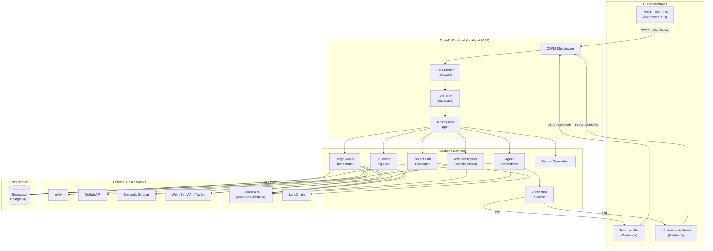
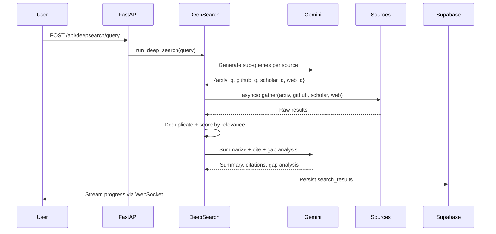

<div align="center">


<br/>

<a href="#">
  
</a>

<br/><br/>

**Innovix** is a full-stack AI copilot that transforms raw ideas into structured, researched, and actionable project blueprints — complete with tech stack recommendations, architecture diagrams, phased roadmaps, and multi-platform bot integration.

<br/>

[](https://python.org)
[](https://fastapi.tiangolo.com)
[](https://react.dev)
[](https://typescriptlang.org)
[](https://vitejs.dev)
[](https://supabase.com)
[](https://ai.google.dev)

<br/>

[](LICENSE)
[](CONTRIBUTING.md)
[](#)
[](#)

</div>

---

## Contents

- [Overview](#overview)
- [The Problem & Solution](#the-problem--solution)
- [Key Features](#key-features)
- [System Architecture](#system-architecture)
- [How It Works](#how-it-works)
- [Tech Stack](#tech-stack)
- [AI & Agent Architecture](#ai--agent-architecture)
- [Project Structure](#project-structure)
- [Getting Started](#getting-started)
- [Environment Variables](#environment-variables)
- [Running the Project](#running-the-project)
- [API Reference](#api-reference)
- [Database](#database)
- [Security](#security)
- [Deployment](#deployment)
- [Roadmap](#roadmap)
- [Contributing](#contributing)

---

## Overview

Innovix bridges the gap between an idea and a buildable project. Students and researchers typically have to context-switch between a dozen tools — academic databases, GitHub, design software, task trackers, and general-purpose AI chatbots — just to start planning a project.

Innovix replaces this fragmented workflow with a single AI workspace. It:

1. Runs a multi-source **DeepSearch** across arXiv, GitHub, Semantic Scholar, and the open web simultaneously.
2. Groups those results into thematic clusters using a **K-Means embedding pipeline**.
3. Feeds the verified research into **Gemini** to generate a structured project plan including problem validation, existing solutions, innovation opportunities, tech stack, Mermaid architecture diagrams, and phased roadmaps.
4. Keeps users connected to their workspace via **Telegram and WhatsApp bots** that can answer questions, check project status, and send proactive reminders.
5. Provides **multilingual support** through the Sarvam AI translation API for 10 Indian languages plus English.

---

## The Problem & Solution

### The Problem

Students and early-stage innovators lack a structured, automated bridge between an idea and the execution phase. Researching a topic, validating feasibility, designing an architecture, and tracking a roadmap are all separate, time-consuming, manual processes. General-purpose AI chatbots can generate text but do not verify it against real academic or open-source sources, and they produce no persistent, structured artifacts.

### The Solution

Innovix automates the full project discovery-to-planning lifecycle:

- **Verified Research** — Every plan is grounded in real papers from arXiv, repositories from GitHub, and academic citations from Semantic Scholar rather than LLM guesswork.
- **Structured Output** — The AI generates JSON-structured plans stored directly in the database, not freeform chat responses, enabling interactive UI components like timeline cards and Mermaid diagrams.
- **Persistent State** — Projects, search results, workspaces, and conversation history are all stored in Supabase PostgreSQL, accessible across the web, Telegram, and WhatsApp.

---

## Key Features

| Feature | Description |
|---------|-------------|
| **DeepSearch Engine** | Parallel async scraping of arXiv, GitHub, Semantic Scholar, and web sources. Gemini generates optimized sub-queries per source, deduplicates results, and produces a cited summary with gap analysis. Streams progress over WebSocket. |
| **Semantic Clustering** | A pure-Python K-Means clustering pipeline over TF-IDF embeddings groups search results into thematic clusters. Each cluster is labeled by Gemini and stored in Supabase for visual exploration. |
| **AI Project Hub** | Three chained Gemini calls produce a complete plan: (1) problem validation + tech stack + opportunities, (2) Mermaid architecture diagram with component breakdown, (3) phased roadmap with weekly timeline and risk assessment. |
| **Web Intelligence** | A dedicated `web_intel` service module runs trend detection via SerpAPI, competitive tracking, news aggregation, and source freshness scoring in parallel. |
| **Multi-Platform Bots** | An `AgentOrchestrator` routes incoming Telegram/WhatsApp messages to four specialized agents: Research, Planning, Reminder, and Q&A — all backed by Gemini and Supabase state. |
| **Sarvam AI Translation** | Translates content via the Sarvam AI API into Hindi, Tamil, Telugu, Bengali, Marathi, Kannada, Gujarati, Malayalam, Punjabi, and English. |
| **Project Export** | An `export_service` generates PDF and PPTX exports of the project plan using `xhtml2pdf` and `python-pptx`. |
| **Rate Limiting** | API-level request throttling via `slowapi` at 100 requests/minute per IP. |
| **Research Workspaces** | Per-project workspaces with structured notes, saved search results, and annotations. |

---

## System Architecture



---

## How It Works

**1. Authentication**
The user signs in via Supabase Auth (email/password or OAuth). The React frontend stores the JWT, which is sent as a `Bearer` token on every subsequent API call. The FastAPI `security.py` middleware verifies the token against Supabase on each protected route.

**2. Research (DeepSearch)**
The user submits a query. The backend's `deep_search.py` calls Gemini to generate optimized sub-queries for each data source, then fans out with `asyncio.gather` across arXiv, GitHub, Semantic Scholar, and web APIs simultaneously. Results are deduplicated by URL, scored by relevance, and persisted to Supabase. Gemini then produces a cited summary and gap analysis. Progress events stream back to the browser over a WebSocket connection.

**3. Knowledge Clustering**
The user can trigger clustering on any saved search results. `embedder.py` converts result titles and snippets into TF-IDF vectors. `clusterer.py` runs K-Means (K=4 by default) over those vectors using cosine similarity. `labeler.py` sends the grouped results to Gemini to generate a human-readable cluster label. Clusters are saved to Supabase and visualized on the frontend.

**4. Project Hub Generation**
The user creates a project (title + idea text). The `generator.py` service fetches associated search results from Supabase, then makes three sequential Gemini calls using structured prompts to produce: (a) problem validation, existing solutions, tech stack, innovation opportunities; (b) a complete Mermaid architecture diagram with component breakdown; (c) a phased roadmap with weekly milestones and risk registry. The entire plan is stored in Supabase JSONB columns.

**5. Bot Interaction**
When a message arrives at `/api/agents/telegram/webhook` or `/api/agents/whatsapp/webhook`, the `AgentOrchestrator` classifies the intent (search, projects, status, remind, ask, help) and routes to the appropriate agent function. Responses are sent back via the Telegram Bot API or Twilio REST API. The `NotificationService` also enables proactive push messages.

**6. Translation & TTS**
The frontend `AutoTranslator` component posts content to `/api/translation/batch`. The backend `translation.py` service forwards requests to the Sarvam AI Translate API. A `tts_service.py` handles text-to-speech via Sarvam AI for supported Indian languages.

---

## Tech Stack

### Frontend
| Technology | Version | Purpose |
|------------|---------|---------|
| React | 18 | UI component model |
| TypeScript | 5 | Type-safe frontend |
| Vite | 6 | Dev server and build tooling |
| TailwindCSS | 3 | Utility-first styling |
| Framer Motion | 12 | Page and component animations |
| Radix UI | — | Accessible UI primitives (Dialog, Tabs, Dropdown, Tooltip, etc.) |
| Zustand | 5 | Global auth and app state |
| TanStack Query | 5 | Server state, caching, background refetch |
| React Router | 7 | Client-side routing |
| Axios | 1.9 | HTTP client |
| Recharts | 2 | Data visualization |
| Mermaid | 11 | In-browser architecture diagram rendering |
| i18next | 26 | Internationalization |
| Lucide React | — | Icon library |
| html2pdf.js | — | Client-side PDF generation |

### Backend
| Technology | Version | Purpose |
|------------|---------|---------|
| FastAPI | 0.115 | Async REST API and WebSocket framework |
| Uvicorn | 0.34 | ASGI server |
| Pydantic v2 | ≥2.12 | Request/response validation and settings |
| python-dotenv | 1.1 | Environment variable loading |
| slowapi | — | Rate limiting middleware |
| orjson | 3.10 | High-performance JSON serialization |

### AI & Machine Learning
| Technology | Version | Purpose |
|------------|---------|---------|
| Google GenAI SDK | ≥1.21 | Direct Gemini API access |
| LangChain | 0.3.25 | Prompt chaining and structured output |
| langchain-google-genai | 2.1.4 | LangChain × Gemini integration |
| NumPy | 2.3 | Numerical array operations |
| Scikit-learn | 1.7 | TF-IDF vectorization and K-Means clustering |

### Data Sources
| Technology | Purpose |
|------------|---------|
| arxiv (PyPI) | arXiv academic paper search |
| PyGithub | GitHub repository search via API |
| httpx | Async HTTP for Semantic Scholar and SerpAPI |
| aiohttp | Async HTTP for web source scraping |

### Bots & Notifications
| Technology | Version | Purpose |
|------------|---------|---------|
| python-telegram-bot | 22.2 | Telegram Bot API integration |
| twilio | 9.6 | WhatsApp messaging via Twilio |

### Database & Auth
| Technology | Version | Purpose |
|------------|---------|---------|
| Supabase | 2.15 | PostgreSQL database + Auth + Row Level Security |
| postgrest | 1.0 | Supabase REST client |

### Export & Utilities
| Technology | Purpose |
|------------|---------|
| xhtml2pdf | Server-side PDF generation |
| python-pptx | PowerPoint export |
| markdown | Markdown-to-HTML conversion |
| Sarvam AI | Translation and TTS for 10 Indian languages |

---

## AI & Agent Architecture

### DeepSearch Pipeline



### Agent System

The `AgentOrchestrator` classifies each incoming message into one of five intents and delegates to the appropriate handler:

| Agent | Intent | Responsibility | Input | Output |
|-------|--------|----------------|-------|--------|
| Research Agent | `search` | Runs a quick DeepSearch query | Free text | Summarized findings |
| Planning Agent | `projects` / `status` | Fetches project list or status | Command | Project summary |
| Reminder Agent | `remind` | Schedules and sends notifications | Reminder text | Confirmation + push notification |
| Q&A Agent | `ask` / default | Answers questions using project context from Supabase | Free text | Gemini-generated answer |

### Project Hub — Three-Stage Generation

| Stage | Gemini Call | Output |
|-------|-------------|--------|
| 1 — Plan | `get_project_plan_prompt()` | Problem validation, existing solutions, innovation opportunities, tech stack, API/dataset recommendations, GitHub repos, documentation links |
| 2 — Architecture | `get_architecture_prompt()` | Mermaid diagram source, component list, design patterns |
| 3 — Roadmap | `get_roadmap_prompt()` | Phased milestones, weekly timeline, risk registry |

---

## Project Structure

```text
innovix/
├── backend/
│   ├── app/
│   │   ├── api/
│   │   │   ├── agents.py          # Telegram, WhatsApp, Meta webhook routes
│   │   │   ├── auth.py            # Auth profile routes
│   │   │   ├── clusters.py        # Clustering API
│   │   │   ├── dashboard.py       # Dashboard aggregation
│   │   │   ├── deepsearch.py      # DeepSearch REST + WebSocket routes
│   │   │   ├── intelligence.py    # Web intelligence API
│   │   │   ├── projects.py        # Project CRUD + plan generation
│   │   │   ├── translation.py     # Sarvam translation API
│   │   │   └── workspaces.py      # Workspace + notes CRUD
│   │   ├── core/
│   │   │   ├── config.py          # Pydantic settings
│   │   │   ├── database.py        # Supabase client initialization
│   │   │   └── security.py        # Supabase JWT verification middleware
│   │   ├── models/
│   │   │   └── schemas.py         # All Pydantic request/response models
│   │   ├── services/
│   │   │   ├── agents/
│   │   │   │   ├── agent_orchestrator.py   # Intent routing + agent logic
│   │   │   │   └── notification_service.py # Telegram + Twilio push notifications
│   │   │   ├── clustering/
│   │   │   │   ├── clusterer.py   # K-Means implementation
│   │   │   │   ├── embedder.py    # TF-IDF vectorization
│   │   │   │   ├── labeler.py     # Gemini cluster labeling
│   │   │   │   └── visualizer.py  # Cluster visualization data
│   │   │   ├── project_hub/
│   │   │   │   ├── generator.py   # Three-stage Gemini plan generation
│   │   │   │   ├── export_service.py  # PDF + PPTX export
│   │   │   │   └── templates/     # Structured Gemini prompts
│   │   │   ├── sarvam/
│   │   │   │   └── tts_service.py # Sarvam AI TTS
│   │   │   ├── search/
│   │   │   │   ├── deep_search.py # Main orchestrator
│   │   │   │   └── sources/       # arxiv, github, scholar, web adapters
│   │   │   ├── web_intel/
│   │   │   │   ├── trend_detector.py      # SerpAPI + Gemini trend analysis
│   │   │   │   ├── competitive_tracker.py # Competitor analysis
│   │   │   │   ├── freshness_scorer.py    # Source recency scoring
│   │   │   │   └── news_aggregator.py     # Domain news collection
│   │   │   └── translation.py     # Sarvam translate service
│   │   └── main.py                # FastAPI app, routers, CORS, lifespan
│   ├── migrations/                # Supabase SQL migrations
│   ├── .env.example
│   └── requirements.txt
├── bots/
│   ├── telegram_bot.py            # Standalone Telegram bot runner
│   └── whatsapp_bot.py            # Standalone WhatsApp bot runner
├── frontend/
│   ├── src/
│   │   ├── components/            # Shared UI components
│   │   ├── features/
│   │   │   ├── agents/            # AgentsPage
│   │   │   ├── clustering/        # Cluster visualization
│   │   │   ├── deepsearch/        # DeepSearch UI
│   │   │   ├── intelligence/      # Web intelligence views
│   │   │   ├── project-hub/       # Project Hub + Project Detail
│   │   │   └── workspace/         # Research workspace
│   │   ├── hooks/                 # Custom React hooks
│   │   ├── lib/                   # API client + utilities
│   │   ├── pages/
│   │   │   ├── Dashboard.tsx      # Main dashboard
│   │   │   ├── Landing.tsx        # Public landing page
│   │   │   ├── Layout.tsx         # Authenticated app shell
│   │   │   ├── Login.tsx          # Auth page (sign in, sign up, forgot)
│   │   │   └── ResetPassword.tsx  # Password reset
│   │   ├── stores/
│   │   │   └── authStore.ts       # Zustand auth store
│   │   ├── App.tsx
│   │   └── main.tsx
│   └── package.json
├── supabase/
│   └── migrations/                # Supabase database migrations
└── README.md
```

---

## Getting Started

### Prerequisites

- **Node.js** 18 or later
- **Python** 3.12 or later
- **Git**
- A **Supabase** project (free tier works)
- A **Google AI Studio** account for the Gemini API key

### Clone the Repository

```bash
git clone <YOUR_REPOSITORY_URL>
cd innovix
```

### Backend Setup

```bash
cd backend

# Create and activate a virtual environment
python -m venv .venv

# Windows
.venv\Scripts\activate

# macOS / Linux
source .venv/bin/activate

# Install dependencies
pip install -r requirements.txt
```

### Frontend Setup

Open a second terminal:

```bash
cd frontend
npm install
```

---

## Environment Variables

Copy the example file and fill in your credentials:

```bash
cp backend/.env.example backend/.env
```

**`backend/.env`**
```env
# --- Supabase ---
SUPABASE_URL=https://your-project.supabase.co
SUPABASE_ANON_KEY=your-anon-key-here
SUPABASE_SERVICE_ROLE_KEY=your-service-role-key-here

# --- Google Gemini ---
GEMINI_API_KEY=your-gemini-api-key-here

# --- GitHub (for repo search in DeepSearch) ---
GITHUB_TOKEN=your-github-personal-access-token

# --- Search APIs ---
SERPAPI_KEY=your-serpapi-key-here
TAVILY_API_KEY=your-tavily-api-key-here

# --- Semantic Scholar (optional — works without key at lower rate) ---
SEMANTIC_SCHOLAR_API_KEY=

# --- Telegram Bot (optional) ---
TELEGRAM_BOT_TOKEN=your-telegram-bot-token

# --- Twilio / WhatsApp (optional) ---
TWILIO_ACCOUNT_SID=your-twilio-sid
TWILIO_AUTH_TOKEN=your-twilio-auth-token
TWILIO_WHATSAPP_NUMBER=whatsapp:+14155238886

# --- Sarvam AI (optional — required for translation and TTS) ---
SARVAM_API_KEY=your-sarvam-api-key-here

# --- App Config ---
APP_NAME=Innovix
APP_ENV=development
FRONTEND_URL=http://localhost:5173
BACKEND_URL=http://localhost:8000
SECRET_KEY=change-this-to-a-random-secret-key
```

**`frontend/.env`**
```env
VITE_SUPABASE_URL=https://your-project.supabase.co
VITE_SUPABASE_ANON_KEY=your-anon-key-here
VITE_API_URL=http://localhost:8000
```

> **Note:** `TELEGRAM_BOT_TOKEN`, `TWILIO_*`, and `SARVAM_API_KEY` are optional. Core research and project planning features work without them.

---

## Running the Project

**Terminal 1 — Backend**
```bash
cd backend
uv run uvicorn app.main:app --reload --port 8000
# or: uvicorn app.main:app --reload --port 8000
```

API available at `http://localhost:8000`
Swagger docs at `http://localhost:8000/docs`

**Terminal 2 — Frontend**
```bash
cd frontend
npm run dev
```

App available at `http://localhost:5173`

**Terminal 3 — Telegram/WhatsApp (optional, for local bot testing)**

To test bots locally, expose your backend using [ngrok](https://ngrok.com):
```bash
ngrok http 8000
```

Then register your webhook with Telegram:
```
https://api.telegram.org/bot<TOKEN>/setWebhook?url=<NGROK_URL>/api/agents/telegram/webhook
```

---

## API Reference

FastAPI automatically generates interactive API documentation at `http://localhost:8000/docs`.

| Method | Endpoint | Auth | Description |
|--------|----------|------|-------------|
| `GET` | `/health` | — | Health check |
| `GET` | `/api/auth/profile` | ✓ | Get current user profile |
| `PATCH` | `/api/auth/profile` | ✓ | Update user profile |
| `POST` | `/api/deepsearch/query` | ✓ | Run a DeepSearch (REST) |
| `WS` | `/api/deepsearch/stream` | ✓ | Run a DeepSearch (WebSocket stream) |
| `GET` | `/api/deepsearch/history` | ✓ | List past searches |
| `POST` | `/api/projects/` | ✓ | Create a new project |
| `GET` | `/api/projects/` | ✓ | List user projects |
| `GET` | `/api/projects/{id}` | ✓ | Get project details |
| `PATCH` | `/api/projects/{id}` | ✓ | Update project |
| `DELETE` | `/api/projects/{id}` | ✓ | Delete project |
| `POST` | `/api/projects/{id}/generate` | ✓ | Generate AI plan for project |
| `POST` | `/api/clusters/generate` | ✓ | Run clustering on search results |
| `GET` | `/api/clusters/{id}` | ✓ | Get clusters for a search |
| `GET` | `/api/dashboard/` | ✓ | Aggregated dashboard data |
| `GET` | `/api/dashboard/activity` | ✓ | Recent activity feed |
| `GET` | `/api/intelligence/trends` | ✓ | Trending topics in a domain |
| `POST` | `/api/translation/batch` | ✓ | Translate text via Sarvam AI |
| `POST` | `/api/agents/telegram/webhook` | — | Telegram webhook receiver |
| `POST` | `/api/agents/whatsapp/webhook` | — | Twilio WhatsApp webhook receiver |
| `GET` | `/api/agents/meta/webhook` | — | Meta webhook verification |
| `POST` | `/api/workspaces/` | ✓ | Create a workspace |
| `POST` | `/api/workspaces/{id}/notes` | ✓ | Add a note to a workspace |

---

## Database

Innovix uses **Supabase (PostgreSQL)** with Row Level Security. The backend communicates via the `supabase-py` client using the service role key for admin operations and the anon key for user-scoped operations.

Key tables derived from schemas and service code:

| Table | Purpose |
|-------|---------|
| `users` (Supabase Auth) | Authentication and user metadata |
| `projects` | Project records with JSONB columns for `project_plan`, `tech_stack`, `architecture`, `timeline` |
| `search_results` | Persisted DeepSearch runs with sources, summary, citations, and gap analysis |
| `clusters` | K-Means clustering output grouped by `search_result_id` |
| `workspaces` | Per-project research workspaces with notes and saved results |
| `agent_sessions` | Maps `chat_id` from Telegram/WhatsApp to Supabase `user_id` for bot continuity |

SQL migration files are located in `supabase/migrations/` and `backend/migrations/`.

---

## Security

| Mechanism | Implementation |
|-----------|---------------|
| **Authentication** | Supabase Auth — email/password and OAuth providers |
| **JWT Verification** | Every protected route calls `supabase.auth.get_user(token)` via `security.py` |
| **Row Level Security** | Enforced at the Supabase database level per user |
| **CORS** | Strict origin allowlist — only `FRONTEND_URL` and localhost in dev |
| **Rate Limiting** | 100 requests/minute per IP via `slowapi` |
| **CAPTCHA** | Cloudflare Turnstile on the login/signup forms |
| **Secret Key** | Application fails to start in production if `SECRET_KEY` is left as default |
| **Environment Variables** | No credentials in source code; all secrets via `.env` files excluded from git |
| **Webhook Endpoints** | Telegram and Twilio webhook endpoints are public (no JWT) but validated by payload structure |

---

## Deployment

> Deployment URLs are pending configuration. The sections below describe the intended production setup.

### Frontend — Vercel

1. Import the repository on [Vercel](https://vercel.com).
2. Set the **Root Directory** to `frontend`.
3. Add all `VITE_*` environment variables, setting `VITE_API_URL` to your deployed backend URL.
4. Deploy.

### Backend — Render

1. Create a **Web Service** on [Render](https://render.com).
2. Set **Root Directory** to `backend`.
3. Set **Build Command** to `pip install -r requirements.txt`.
4. Set **Start Command** to `uvicorn app.main:app --host 0.0.0.0 --port $PORT`.
5. Add all backend environment variables.
6. Update `FRONTEND_URL` to your Vercel URL and re-register Telegram/Twilio webhooks.

### Database — Supabase

The database is hosted on Supabase. Run SQL migration files from `supabase/migrations/` in the Supabase SQL Editor to initialize the schema.

---

## Roadmap

### Completed
- [x] FastAPI backend with full router structure and Pydantic v2 schemas
- [x] Supabase auth integration with JWT middleware
- [x] DeepSearch engine across arXiv, GitHub, Semantic Scholar, and web
- [x] WebSocket streaming for DeepSearch progress
- [x] K-Means clustering pipeline with Gemini-powered cluster labeling
- [x] Three-stage AI Project Hub generator (plan, architecture, roadmap)
- [x] PDF and PPTX export service
- [x] Telegram bot with AgentOrchestrator (Research, Planning, Reminder, Q&A agents)
- [x] WhatsApp integration via Twilio webhooks
- [x] Sarvam AI translation service (10 Indian languages + English)
- [x] Web intelligence module (trend detection, competitive tracking, news, freshness scoring)
- [x] Rate limiting, CORS, and Cloudflare Turnstile CAPTCHA
- [x] React frontend with Dashboard, DeepSearch, Project Hub, Agents pages
- [x] Zustand auth store and TanStack Query for server state

### In Progress
- [ ] Sarvam AI TTS integration in the frontend UI
- [ ] Meta WhatsApp Cloud API webhook (infrastructure is in place)

### Planned
- [ ] Production deployment on Vercel + Render
- [ ] Email notification support
- [ ] Collaborative project workspaces (multi-user)
- [ ] GitHub repository auto-scaffold from generated project plan

---

## Contributing

Contributions are welcome.

1. Fork the repository.
2. Create a feature branch: `git checkout -b feature/your-feature-name`
3. Make your changes and ensure existing functionality is not broken.
4. Commit with a clear message: `git commit -m "feat: add your feature description"`
5. Push to your fork: `git push origin feature/your-feature-name`
6. Open a pull request against the `main` branch.

Please follow the existing code style and include comments on non-obvious logic.

---

## License

This project is licensed under the **MIT License**. See the [LICENSE](LICENSE) file for details.

---

<div align="center">

Built with care by the Innovix team.

If this project helped you, consider giving it a ⭐


</div>
