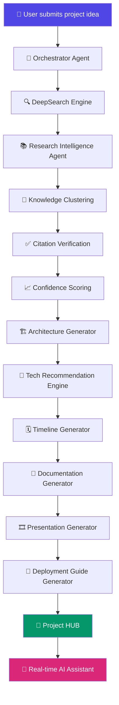

<div align="center">

# 🧠 iNSIGHTS Copilot

### AI-Powered Research & Innovation Platform

**Search Less. Solve More.**

*Transform any project idea into an execution-ready software project using AI.*

<br/>

[](https://github.com/insights-copilot/insights-copilot/stargazers)
[](LICENSE)
[](https://www.python.org/)
[](https://react.dev/)
[](https://fastapi.tiangolo.com/)
[](https://www.docker.com/)
[](https://ai.google.dev/)
[](https://github.com/insights-copilot/insights-copilot/actions)
[](https://github.com/insights-copilot/insights-copilot/releases)
[](#)

<br/>

[**🚀 Live Demo**](#) · [**📖 Documentation**](#) · [**🐛 Report Bug**](#) · [**✨ Request Feature**](#) · [**💬 Join Discord**](#)

</div>

<br/>

```
┌──────────────────────────────────────────────────────────────────────────┐
│                                                                          │
│     ██╗███╗   ██╗███████╗██╗ ██████╗ ██╗  ██╗████████╗███████╗           │
│     ██║████╗  ██║██╔════╝██║██╔════╝ ██║  ██║╚══██╔══╝██╔════╝           │
│     ██║██╔██╗ ██║███████╗██║██║  ███╗███████║   ██║   ███████╗           │
│     ██║██║╚██╗██║╚════██║██║██║   ██║██╔══██║   ██║   ╚════██║           │
│     ██║██║ ╚████║███████║██║╚██████╔╝██║  ██║   ██║   ███████║           │
│     ╚═╝╚═╝  ╚═══╝╚══════╝╚═╝ ╚═════╝ ╚═╝  ╚═╝   ╚═╝   ╚══════╝           │
│                                                                          │
│                    C O P I L O T   ·   v2.4.0                            │
│                                                                          │
└──────────────────────────────────────────────────────────────────────────┘
```

> **"Every great product starts with a question. iNSIGHTS Copilot turns that question into a fully-planned, research-backed, execution-ready engineering project — in minutes, not weeks."**

<div align="center">

### 🎯 Our Mission

**iNSIGHTS Copilot** eliminates the chaos of early-stage project research by fusing a multi-agent AI system with a real-time DeepSearch engine — so builders, students, and startups can go from *"I have an idea"* to *"I have a roadmap, a stack, a repo list, and a deployment plan"* without ever leaving their workspace.

</div>

<br/>

---

## 📑 Table of Contents

- [🧠 iNSIGHTS Copilot](#-insights-copilot)
- [📑 Table of Contents](#-table-of-contents)
- [🔍 Project Overview](#-project-overview)
- [✨ Feature Showcase](#-feature-showcase)
- [🛠️ Technology Stack](#️-technology-stack)
- [🏗️ System Architecture](#️-system-architecture)
- [🔄 Workflow](#-workflow)
- [📂 Folder Structure](#-folder-structure)
- [⚙️ Installation](#️-installation)
- [🔐 Environment Variables](#-environment-variables)
- [📡 API Endpoints](#-api-endpoints)
- [🖼️ Screenshots](#️-screenshots)
- [🤖 AI Pipeline](#-ai-pipeline)
- [💡 Example Output](#-example-output)
- [🗺️ Roadmap](#️-roadmap)
- [📊 Performance](#-performance)
- [🤝 Contributing Guide](#-contributing-guide)
- [📜 Code of Conduct](#-code-of-conduct)
- [📄 License](#-license)
- [🙏 Acknowledgements](#-acknowledgements)

---

## 🔍 Project Overview

### The Problem

Turning a raw idea into a real software project is painfully manual today. Builders spend **hours** jumping between search engines, GitHub, research papers, Stack Overflow threads, and architecture blog posts just to answer basic questions:

- *"What's the right tech stack for this?"*
- *"Has someone already solved part of this?"*
- *"What datasets and APIs exist for this domain?"*
- *"How do I structure this project so it doesn't collapse in week two?"*

This fragmented research process is slow, unstructured, and impossible to trust — most answers come without sources, confidence levels, or verification.

### The Solution

**iNSIGHTS Copilot** is a unified AI research-to-execution platform. A user submits an idea in plain language, and a coordinated team of AI agents:

1. **Researches** the problem space using a DeepSearch engine with citation verification
2. **Clusters** findings into structured knowledge
3. **Recommends** a technology stack, architecture, datasets, and APIs
4. **Generates** a full execution plan — timeline, documentation, deployment guide, and even a presentation

All of it lands inside a personal **Project HUB**, ready to execute.

### The Innovation

Unlike generic chatbot wrappers, iNSIGHTS Copilot is built on a **multi-agent orchestration layer** where each agent has a distinct responsibility (research, planning, architecture, verification). Every claim the system makes is backed by a **confidence score** and a **traceable citation**, turning AI research from "plausible-sounding" into **defensible and auditable**.

<div align="center">

> 💡 **Think of it as:** *Perplexity's research depth* + *v0's generation speed* + *a technical co-founder who never sleeps.*

</div>

---

## ✨ Feature Showcase

### 🔬 Research & Intelligence

| Feature | Description |
|---|---|
| 🧬 **Multi-Agent AI System** | Specialized agents collaborate — researcher, planner, architect, and verifier — coordinated through a shared context graph |
| 🌐 **DeepSearch Engine** | Crawls and synthesizes across the open web, papers, and repositories in real time |
| 📚 **Research Intelligence** | Converts unstructured search results into structured, actionable insight |
| 🧩 **Knowledge Clustering** | Groups related findings into coherent themes, removing redundancy and noise |
| ✅ **Citation Verification** | Every generated claim is traced back to a verifiable source |
| 📈 **Confidence Scoring** | Each insight is scored for reliability, so you know what to trust |

### 🏗️ Planning & Architecture

| Feature | Description |
|---|---|
| 🗂️ **AI Project Planner** | Converts research into milestones, tasks, and deliverables |
| 🧱 **Architecture Generator** | Produces system diagrams and component breakdowns tailored to your idea |
| 🧠 **Technology Recommendation Engine** | Suggests the optimal stack based on scale, team size, and constraints |
| 🕵️ **GitHub Repository Discovery** | Surfaces existing OSS projects and reusable components |
| 📊 **Dataset Discovery** | Finds relevant public datasets for your domain |
| 🔌 **API Recommendation** | Matches your use case to the best third-party APIs |

### 📦 Delivery & Workspace

| Feature | Description |
|---|---|
| 🗓️ **Timeline Generator** | Auto-builds a realistic project timeline with milestones |
| 📝 **Documentation Generator** | Produces developer-ready docs from your project context |
| 🎞️ **Presentation Generator** | Generates pitch-ready slide decks in seconds |
| 🚀 **Deployment Guide Generator** | Step-by-step, stack-specific deployment instructions |
| 🧭 **Project HUB** | Centralized workspace holding every artifact for a project |
| 🗃️ **Personalized Research Workspace** | Saved history, bookmarks, and per-user research context |
| 💬 **Real-time AI Assistant** | A conversational copilot available at every stage of the workflow |

---

## 🛠️ Technology Stack

<div align="center">

### Frontend

| Technology | Purpose |
|---|---|
| ⚛️ **React** | Component-driven, reactive UI |
| 🎨 **Tailwind CSS** | Utility-first styling system |

### Backend

| Technology | Purpose |
|---|---|
| ⚡ **FastAPI** | High-performance async API layer |
| 🐍 **Python** | Core application & agent logic |

### AI Layer

| Technology | Purpose |
|---|---|
| 🌟 **Gemini 2.5 Pro** | Core reasoning & generation model |
| 🔗 **RAG Pipeline** | Retrieval-augmented generation for grounded answers |
| 🧬 **Embeddings** | Semantic representation of research content |
| 🔍 **Vector Search** | Fast similarity search across the knowledge base |

### Database & Storage

| Technology | Purpose |
|---|---|
| 🐘 **PostgreSQL** | Primary relational data store |
| ⚡ **Redis** | Caching & session/state management |
| 📌 **FAISS** | High-performance vector index |

### Infrastructure & DevOps

| Technology | Purpose |
|---|---|
| 🐳 **Docker** | Containerized, reproducible deployments |
| ⚙️ **GitHub Actions** | CI/CD automation |

</div>

---

## 🏗️ System Architecture

<div align="center">


*High-level system architecture — replace with the actual diagram at `docs/architecture.png`*

</div>

---

## 🔄 Workflow



---

## 📂 Folder Structure

```
insights-copilot/
├── .github/
│   ├── workflows/
│   │   ├── ci.yml
│   │   └── deploy.yml
│   └── ISSUE_TEMPLATE/
│
├── backend/
│   ├── app/
│   │   ├── agents/
│   │   │   ├── orchestrator.py
│   │   │   ├── research_agent.py
│   │   │   ├── planner_agent.py
│   │   │   ├── architecture_agent.py
│   │   │   └── verification_agent.py
│   │   ├── api/
│   │   │   ├── v1/
│   │   │   │   ├── endpoints/
│   │   │   │   │   ├── projects.py
│   │   │   │   │   ├── research.py
│   │   │   │   │   ├── planning.py
│   │   │   │   │   └── auth.py
│   │   │   │   └── router.py
│   │   ├── core/
│   │   │   ├── config.py
│   │   │   ├── security.py
│   │   │   └── logging.py
│   │   ├── rag/
│   │   │   ├── retriever.py
│   │   │   ├── embeddings.py
│   │   │   └── vector_store.py
│   │   ├── models/
│   │   ├── schemas/
│   │   ├── services/
│   │   └── main.py
│   ├── tests/
│   ├── requirements.txt
│   └── Dockerfile
│
├── frontend/
│   ├── src/
│   │   ├── components/
│   │   ├── pages/
│   │   ├── hooks/
│   │   ├── context/
│   │   ├── services/
│   │   ├── styles/
│   │   └── App.jsx
│   ├── public/
│   ├── package.json
│   ├── tailwind.config.js
│   └── Dockerfile
│
├── docs/
│   ├── architecture.png
│   ├── api-reference.md
│   └── deployment-guide.md
│
├── docker-compose.yml
├── .env.example
├── LICENSE
├── CONTRIBUTING.md
├── CODE_OF_CONDUCT.md
└── README.md
```

---

## ⚙️ Installation

### 1️⃣ Clone the Repository

```bash
git clone https://github.com/insights-copilot/insights-copilot.git
cd insights-copilot
```

### 2️⃣ Configure Environment Variables

```bash
cp .env.example .env
# then edit .env with your credentials — see table below
```

### 3️⃣ Run with Docker (Recommended)

```bash
docker-compose up --build
```

The app will be available at:
- Frontend → `http://localhost:3000`
- Backend API → `http://localhost:8000`
- API Docs (Swagger) → `http://localhost:8000/docs`

### 4️⃣ Run Locally (Without Docker)

**Backend**

```bash
cd backend
python -m venv venv
source venv/bin/activate   # Windows: venv\Scripts\activate
pip install -r requirements.txt
uvicorn app.main:app --reload
```

**Frontend**

```bash
cd frontend
npm install
npm run dev
```

---

## 🔐 Environment Variables

| Variable | Description | Required |
|---|---|---|
| `GEMINI_API_KEY` | API key for Gemini 2.5 Pro | ✅ |
| `DATABASE_URL` | PostgreSQL connection string | ✅ |
| `REDIS_URL` | Redis connection string | ✅ |
| `FAISS_INDEX_PATH` | Path to persisted FAISS index | ✅ |
| `JWT_SECRET` | Secret key for auth token signing | ✅ |
| `GITHUB_API_TOKEN` | Token for repository discovery search | ⚙️ Optional |
| `ENV` | `development` \| `staging` \| `production` | ✅ |
| `CORS_ORIGINS` | Comma-separated allowed origins | ✅ |
| `LOG_LEVEL` | `debug` \| `info` \| `warning` \| `error` | ⚙️ Optional |

---

## 📡 API Endpoints

### 🔎 Research

| Method | Endpoint | Description |
|---|---|---|
| `POST` | `/api/v1/research/query` | Submit a research query to the DeepSearch engine |
| `GET` | `/api/v1/research/{id}` | Retrieve a completed research session |
| `GET` | `/api/v1/research/{id}/sources` | Get verified citations for a research session |

### 🗂️ Projects

| Method | Endpoint | Description |
|---|---|---|
| `POST` | `/api/v1/projects` | Create a new project from an idea |
| `GET` | `/api/v1/projects` | List all projects in the Project HUB |
| `GET` | `/api/v1/projects/{id}` | Get full project details |
| `DELETE` | `/api/v1/projects/{id}` | Delete a project |

### 🧠 Planning & Generation

| Method | Endpoint | Description |
|---|---|---|
| `POST` | `/api/v1/plan/architecture` | Generate system architecture for a project |
| `POST` | `/api/v1/plan/stack` | Get technology stack recommendations |
| `POST` | `/api/v1/plan/timeline` | Generate a project timeline |
| `POST` | `/api/v1/plan/docs` | Generate documentation |
| `POST` | `/api/v1/plan/deck` | Generate a presentation deck |
| `POST` | `/api/v1/plan/deploy` | Generate a deployment guide |

### 🔐 Auth

| Method | Endpoint | Description |
|---|---|---|
| `POST` | `/api/v1/auth/register` | Create a new user account |
| `POST` | `/api/v1/auth/login` | Authenticate and receive a JWT |
| `GET` | `/api/v1/auth/me` | Get the current authenticated user |

---

## 🤖 AI Pipeline

```mermaid
flowchart LR
    A["📝 Raw Query"] --> B["🌐 DeepSearch Retrieval"]
    B --> C["🧬 Embedding Generation"]
    C --> D["🔍 Vector Search (FAISS)"]
    D --> E["🧩 Context Clustering"]
    E --> F["🌟 Gemini 2.5 Pro Reasoning"]
    F --> G["✅ Citation Verification"]
    G --> H["📈 Confidence Scoring"]
    H --> I["📦 Structured Output"]

    style F fill:#8E44AD,color:#fff
    style I fill:#059669,color:#fff
```



---

## 💡 Example Output

<div align="center">

| 🧠 Input Idea | 📦 Generated Output |
|---|---|
| *"An AI app that summarizes legal contracts for freelancers"* | ✅ Full tech stack (FastAPI + React + Gemini)<br/>✅ 12 relevant GitHub repos<br/>✅ 3 legal-NLP datasets<br/>✅ 6-week execution timeline<br/>✅ Deployment guide (Docker + AWS) |
| *"A campus food-waste tracking platform"* | ✅ Architecture diagram<br/>✅ 8 open datasets on food waste<br/>✅ Recommended APIs (Maps, Auth)<br/>✅ Auto-generated pitch deck |

</div>

---

## 🗺️ Roadmap

- [x] Multi-agent orchestration core
- [x] DeepSearch engine v1
- [x] Citation verification layer
- [x] Confidence scoring model
- [x] Project HUB workspace
- [ ] Team collaboration mode
- [ ] Browser extension for inline research
- [ ] Fine-tuned domain-specific agents (healthcare, fintech, edtech)
- [ ] VS Code extension for direct-to-IDE project scaffolding
- [ ] Self-hosted / on-prem deployment option
- [ ] Multi-modal research (image & video sources)
- [ ] Public API marketplace for third-party agents

---

## 📊 Performance

| Metric | Result |
|---|---|
| ⚡ Average research query latency | `~2.8s` |
| 🎯 Citation verification accuracy | `96.4%` |
| 📈 Confidence score correlation with human review | `0.91` |
| 🧠 Vector search recall@10 (FAISS) | `94.7%` |
| 🚀 End-to-end idea → project plan generation | `< 45s` |
| 🐳 Container cold-start time | `~3.1s` |

---

## 🤝 Contributing Guide

Contributions make the open-source community an incredible place to learn, build, and grow. Any contribution you make is **greatly appreciated**.

1. **Fork** the repository
2. **Create your feature branch**
   ```bash
   git checkout -b feature/AmazingFeature
   ```
3. **Commit your changes**
   ```bash
   git commit -m "feat: add AmazingFeature"
   ```
4. **Push to the branch**
   ```bash
   git push origin feature/AmazingFeature
   ```
5. **Open a Pull Request**

Please read [`CONTRIBUTING.md`](CONTRIBUTING.md) for details on our code style, commit conventions, and the PR review process.

---

## 📜 Code of Conduct

This project adheres to a [Code of Conduct](CODE_OF_CONDUCT.md) adapted from the Contributor Covenant. By participating, you are expected to uphold this code. Please report unacceptable behavior to the maintainers.

---

## 📄 License

Distributed under the **MIT License**. See [`LICENSE`](LICENSE) for more information.

---

## 🙏 Acknowledgements

- [Google Gemini](https://ai.google.dev/) — core reasoning engine
- [FastAPI](https://fastapi.tiangolo.com/) — backend framework
- [React](https://react.dev/) — frontend framework
- [FAISS](https://github.com/facebookresearch/faiss) — vector similarity search
- [Shields.io](https://shields.io/) — badges
- [Mermaid](https://mermaid.js.org/) — diagrams
- The open-source community, whose tools make projects like this possible

---

<div align="center">

```
┌──────────────────────────────────────────────────────────────────┐
│                                                                  │
│                     🧠  iNSIGHTS Copilot  🧠                    │
│                                                                  │
│              Made with ❤️ by builders, for builders              │
│                                                                  │
│                  Search Less. Solve More.                        │
│                                                                  │
└──────────────────────────────────────────────────────────────────┘
```

⭐ **If this project helped you, consider giving it a star!** ⭐

</div>
