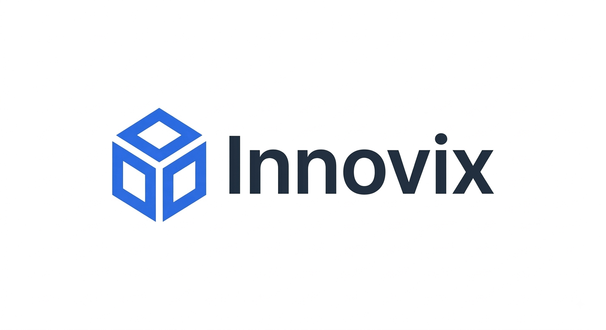
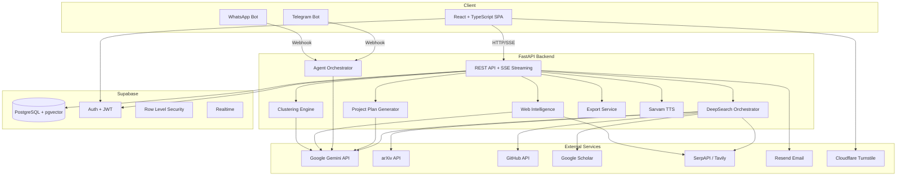
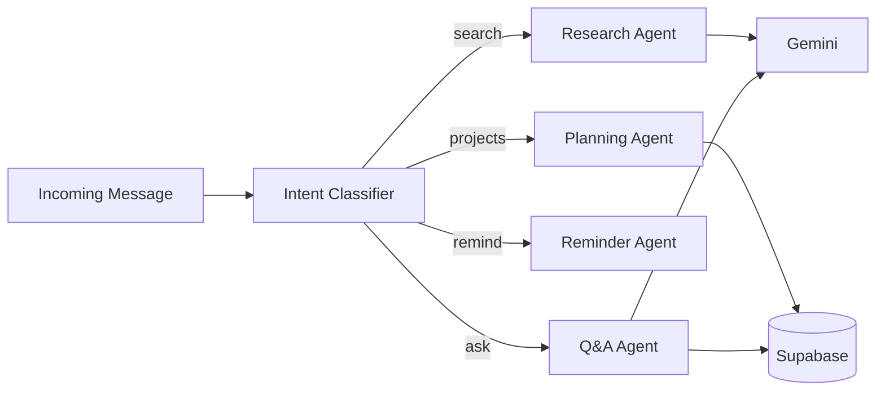
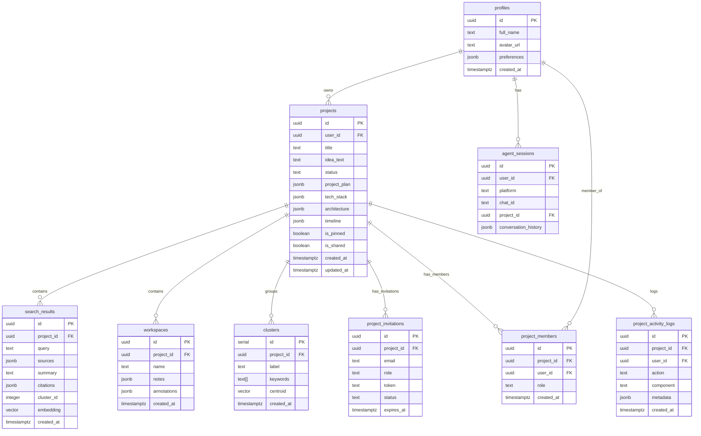

<div align="center">



# Innovix

### Search Less. Solve More.

AI-powered research and innovation copilot that helps students go from a raw idea to a structured, buildable project plan — using multi-source deep search, AI-generated architectures, and real-time collaboration.

[](https://python.org)
[](https://fastapi.tiangolo.com)
[](https://react.dev)
[](https://typescriptlang.org)
[](https://supabase.com)
[](https://ai.google.dev)

[](https://github.com/helloaziz07/innovix/commits/main)
[](https://github.com/helloaziz07/innovix/stargazers)
[](https://github.com/helloaziz07/innovix/issues)

<br/>


</div>

---

## Table of Contents

- [Overview](#overview)
- [Problem & Solution](#problem--solution)
- [Key Features](#key-features)
- [Demo](#demo)
- [System Architecture](#system-architecture)
- [How It Works](#how-it-works)
- [Tech Stack](#tech-stack)
- [Project Structure](#project-structure)
- [Getting Started](#getting-started)
  - [Prerequisites](#prerequisites)
  - [Clone the Repository](#clone-the-repository)
  - [Backend Setup](#backend-setup)
  - [Frontend Setup](#frontend-setup)
  - [Database Setup](#database-setup)
  - [Environment Variables](#environment-variables)
- [Running the Application](#running-the-application)
- [API Documentation](#api-documentation)
- [AI & Agent Architecture](#ai--agent-architecture)
- [Database Schema](#database-schema)
- [Security](#security)
- [Roadmap](#roadmap)
- [Contributing](#contributing)
- [Contributors](#contributors)
- [License](#license)

---

## Overview

**Innovix** is a full-stack web application designed for students, researchers, and early-stage builders who want to validate and plan their project ideas using AI.

Instead of manually searching across arXiv, GitHub, Google Scholar, and the web, then stitching together findings into a plan — Innovix automates the entire pipeline:

1. **DeepSearch** — Searches multiple academic and technical sources in parallel, deduplicates results, and generates an AI-synthesized summary with citations and gap analysis.
2. **Project HUB** — Takes your idea + research and generates a complete project plan, tech stack recommendations, system architecture (with Mermaid diagrams), and a phased development timeline.
3. **AI Sidekick** — A context-aware chat assistant embedded in each project that understands your plan and can answer questions about it.
4. **Multi-Agent Bots** — Telegram and WhatsApp bots that let you search, check project status, and get AI answers from your phone.

The application is built with a React + TypeScript frontend, a FastAPI + Python backend, Google Gemini as the AI engine, and Supabase for database, auth, and real-time features.

---

## Problem & Solution

### The Problem

Students and early-stage builders spend hours manually searching across scattered sources (arXiv, GitHub, Google Scholar, blogs), then struggle to synthesize findings into a structured, actionable project plan. There is no unified tool that connects *research* to *planning* to *execution*.

### The Solution

Innovix bridges the gap between **idea** and **implementation**. It combines a multi-source AI research engine with automated project planning — so users can go from a one-line idea to a complete project plan with architecture diagrams, tech stack recommendations, and a development timeline in minutes, not days.

---

## Key Features

| Feature | Description |
|---|---|
| **DeepSearch Engine** | Parallel search across arXiv, GitHub, Google Scholar, and the web with AI-powered summarization, citations, and gap analysis |
| **AI Project Plan Generation** | Chained Gemini prompts produce problem validation, tech stack, architecture (Mermaid), and phased roadmaps from your idea |
| **Architecture Diagrams** | Auto-generated Mermaid system architecture diagrams with component breakdowns and design pattern recommendations |
| **Knowledge Clustering** | Gemini embeddings + scikit-learn clustering group your search results into semantic themes with auto-generated labels |
| **Web Intelligence** | Trend detection, news aggregation, freshness scoring, and competitive tracking for any research domain |
| **Team Collaboration** | Invite team members (editor/viewer roles), real-time activity feeds, and email invitations via Resend |
| **AI Sidekick Chat** | Context-aware SSE chat per project — the AI knows your plan, architecture, and tech stack |
| **Magic Edit** | Highlight any section of your plan and use AI commands (Expand, Simplify, Make Technical) to refine it |
| **Multi-Format Export** | Export project plans to Markdown, PDF, or PowerPoint (PPTX) |
| **Multilingual TTS** | Listen to your project plan narrated via Sarvam AI with support for Indian languages |
| **Telegram Bot** | Search, list projects, check status, set reminders, and ask questions — all from Telegram |
| **WhatsApp Bot** | Same agent capabilities accessible via WhatsApp messaging |
| **Dark/Light Mode** | Full theme support across all UI components |
| **Cloudflare Turnstile** | Bot protection on authentication pages |

---

## Demo

| Component | URL |
|---|---|
| Live Application | `<ADD_DEPLOYMENT_URL>` |
| API Documentation (Swagger) | `<ADD_DEPLOYMENT_URL>/docs` |
| API Documentation (ReDoc) | `<ADD_DEPLOYMENT_URL>/redoc` |

> **Note**: If not yet deployed, run locally following the [Getting Started](#getting-started) instructions.

---

## Screenshots

> Screenshots can be added here once the application is running. Place images in a `docs/screenshots/` directory and reference them below.

```
<!-- Example:
| Dashboard | Project Detail |
|---|---|
|  |  |
-->
```

---

## System Architecture



---

## How It Works

```
1. User enters a research idea or question
         ↓
2. DeepSearch sends parallel queries to arXiv, GitHub, Scholar, and Web
         ↓
3. Results are deduplicated, scored, and fused
         ↓
4. Gemini generates an AI summary with inline citations + gap analysis
         ↓
5. Results are stored in Supabase and optionally clustered via embeddings
         ↓
6. User creates a Project from their research
         ↓
7. Plan Generator chains 3 Gemini calls:
   ├── Project Plan (problem validation, existing solutions, innovation gaps)
   ├── Architecture (Mermaid diagram, components, design patterns)
   └── Roadmap (phased milestones, weekly timeline, risk analysis)
         ↓
8. AI Sidekick enables conversational Q&A within the project context
         ↓
9. Team members can be invited to view or edit the project collaboratively
         ↓
10. Plans can be exported to Markdown, PDF, or PPTX
```

---

## Tech Stack

### Frontend

| Technology | Purpose |
|---|---|
| [React 18](https://react.dev) | UI framework |
| [TypeScript 5.8](https://typescriptlang.org) | Type safety |
| [Vite 6](https://vitejs.dev) | Build tool and dev server |
| [Tailwind CSS 3](https://tailwindcss.com) | Utility-first styling |
| [Zustand](https://zustand-demo.pmnd.rs/) | Lightweight state management |
| [React Router 7](https://reactrouter.com) | Client-side routing |
| [TanStack React Query](https://tanstack.com/query) | Server state management |
| [Framer Motion](https://www.framer.com/motion/) | Animations and transitions |
| [Radix UI](https://www.radix-ui.com/) | Accessible UI primitives (Dialog, Tabs, Tooltip, etc.) |
| [Recharts](https://recharts.org) | Dashboard charts and data visualization |
| [Mermaid](https://mermaid.js.org) | Architecture diagram rendering |
| [Lucide React](https://lucide.dev) | Icon library |

### Backend

| Technology | Purpose |
|---|---|
| [FastAPI 0.115](https://fastapi.tiangolo.com) | Async Python API framework |
| [Uvicorn](https://www.uvicorn.org) | ASGI server |
| [Pydantic v2](https://docs.pydantic.dev) | Request/response validation |
| [Pydantic Settings](https://docs.pydantic.dev/latest/concepts/pydantic_settings/) | Environment variable management |
| [SlowAPI](https://github.com/laurentS/slowapi) | Rate limiting (100 req/min) |

### AI / Machine Learning

| Technology | Purpose |
|---|---|
| [Google Gemini](https://ai.google.dev) (`gemini-3.5-flash-lite`) | LLM for summarization, plan generation, intent classification |
| [Gemini Embeddings](https://ai.google.dev) (`text-embedding-004`) | 768-dim vectors for semantic clustering |
| [LangChain](https://langchain.com) | Agent framework for multi-tool research agent |
| [scikit-learn](https://scikit-learn.org) | K-Means clustering for knowledge grouping |

### Database & Auth

| Technology | Purpose |
|---|---|
| [Supabase](https://supabase.com) | Hosted PostgreSQL + Auth + Realtime |
| [pgvector](https://github.com/pgvector/pgvector) | Vector similarity search on embeddings |
| Row Level Security (RLS) | Per-user data isolation enforced at DB level |

### Integrations

| Service | Purpose |
|---|---|
| [arXiv API](https://arxiv.org) | Academic paper search |
| [GitHub API](https://docs.github.com/en/rest) | Repository search |
| [Google Scholar](https://scholar.google.com) (via SerpAPI) | Academic citation search |
| [SerpAPI](https://serpapi.com) / [Tavily](https://tavily.com) | Web search and Google Trends |
| [Sarvam AI](https://sarvam.ai) | Multilingual text-to-speech |
| [Resend](https://resend.com) | Transactional email for invitations |
| [Cloudflare Turnstile](https://www.cloudflare.com/products/turnstile/) | Bot protection on auth pages |
| [Telegram Bot API](https://core.telegram.org/bots/api) | Messaging bot |
| [Twilio](https://twilio.com) | WhatsApp bot messaging |

---

## Project Structure

```text
innovix/
├── backend/
│   ├── app/
│   │   ├── api/                    # FastAPI route handlers
│   │   │   ├── auth.py             # Authentication & profile routes
│   │   │   ├── dashboard.py        # Aggregated dashboard data
│   │   │   ├── deepsearch.py       # DeepSearch SSE streaming endpoint
│   │   │   ├── projects.py         # Project CRUD, plan generation, chat, export
│   │   │   ├── workspaces.py       # Research workspace management
│   │   │   ├── agents.py           # Bot agent API routes
│   │   │   ├── intelligence.py     # Trends, news, freshness, competitors
│   │   │   ├── clusters.py         # Knowledge clustering endpoints
│   │   │   └── invitations.py      # Team invitation handling
│   │   ├── agents/
│   │   │   └── research_agent.py   # LangChain multi-tool research agent
│   │   ├── core/
│   │   │   ├── config.py           # Pydantic Settings (env vars)
│   │   │   ├── database.py         # Supabase client initialization
│   │   │   └── security.py         # JWT verification middleware
│   │   ├── models/
│   │   │   └── schemas.py          # All Pydantic request/response models
│   │   ├── services/
│   │   │   ├── agents/
│   │   │   │   ├── agent_orchestrator.py   # Multi-agent intent router
│   │   │   │   └── notification_service.py # Scheduled notifications
│   │   │   ├── clustering/
│   │   │   │   ├── embedder.py     # Gemini embedding generation
│   │   │   │   ├── clusterer.py    # K-Means clustering
│   │   │   │   ├── labeler.py      # AI-powered cluster labeling
│   │   │   │   └── visualizer.py   # Cluster visualization data
│   │   │   ├── project_hub/
│   │   │   │   ├── generator.py    # Chained Gemini plan generation
│   │   │   │   ├── export_service.py  # MD / PDF / PPTX export
│   │   │   │   └── templates/      # Prompt templates
│   │   │   ├── search/
│   │   │   │   ├── deep_search.py  # DeepSearch orchestrator
│   │   │   │   └── sources/        # arXiv, GitHub, Scholar, Web adapters
│   │   │   ├── sarvam/
│   │   │   │   └── tts_service.py  # Multilingual text-to-speech
│   │   │   ├── web_intel/
│   │   │   │   ├── trend_detector.py      # SerpAPI + Gemini trends
│   │   │   │   ├── news_aggregator.py     # Domain news aggregation
│   │   │   │   ├── freshness_scorer.py    # Result freshness scoring
│   │   │   │   └── competitive_tracker.py # Competitive analysis
│   │   │   └── email_service.py    # Resend / SMTP email
│   │   └── main.py                 # FastAPI app entry point
│   ├── .env.example
│   └── requirements.txt
├── frontend/
│   ├── public/                     # Static assets (logo, images)
│   ├── src/
│   │   ├── components/             # Shared UI components
│   │   ├── features/
│   │   │   ├── deepsearch/         # DeepSearch UI (SearchInput, ResultStream, Citations, GapAnalysis)
│   │   │   ├── project-hub/        # Project HUB UI (PlanViewer, ArchitectureDiagram, Timeline, etc.)
│   │   │   ├── clustering/         # Cluster visualization (ClusterMap, ClusterLabels)
│   │   │   ├── intelligence/       # Web Intelligence UI (Trends, News, Freshness)
│   │   │   ├── agents/             # Agent management page
│   │   │   └── workspace/          # Research workspace (Notes, Annotations, Export)
│   │   ├── pages/                  # Route-level pages (Dashboard, Landing, Login, Layout)
│   │   ├── stores/                 # Zustand stores (authStore, projectStore)
│   │   ├── hooks/                  # Custom React hooks
│   │   ├── lib/                    # API client, utilities
│   │   └── App.tsx                 # Router and app shell
│   ├── .env.example
│   └── package.json
├── bots/
│   ├── telegram_bot.py             # Telegram bot (python-telegram-bot)
│   └── whatsapp_bot.py             # WhatsApp bot (Twilio)
├── supabase/
│   └── migrations/                 # SQL migration files (001–005)
└── README.md
```

---

## Getting Started

### Prerequisites

| Tool | Version | Required |
|---|---|---|
| [Python](https://python.org) | 3.10+ | Yes |
| [Node.js](https://nodejs.org) | 18+ | Yes |
| [npm](https://npmjs.com) | 9+ | Yes |
| [Git](https://git-scm.com) | Any | Yes |
| [Supabase Account](https://supabase.com) | Free tier | Yes |
| [Google AI API Key](https://ai.google.dev) | Gemini access | Yes |

### Clone the Repository

```bash
git clone https://github.com/helloaziz07/innovix.git
cd innovix
```

### Backend Setup

```bash
cd backend

# Create virtual environment
python -m venv .venv

# Activate (Windows)
.venv\Scripts\activate

# Activate (macOS/Linux)
source .venv/bin/activate

# Install dependencies
pip install -r requirements.txt
```

### Frontend Setup

```bash
cd frontend

# Install dependencies
npm install
```

### Database Setup

1. Create a new project on [Supabase](https://supabase.com).
2. Go to **SQL Editor** in your Supabase dashboard.
3. Run the migration files in order:

```
supabase/migrations/001_initial_schema.sql
supabase/migrations/002_team_collaboration.sql
supabase/migrations/003_update_statuses.sql
supabase/migrations/004_activity_logs.sql
supabase/migrations/005_enable_realtime.sql
```

### Environment Variables

#### Backend (`backend/.env`)

Create a `.env` file in the `backend/` directory based on `.env.example`:

```env
# --- Supabase (Required) ---
SUPABASE_URL=https://your-project.supabase.co
SUPABASE_ANON_KEY=your-anon-key-here
SUPABASE_SERVICE_ROLE_KEY=your-service-role-key-here

# --- Google Gemini (Required) ---
GEMINI_API_KEY=your-gemini-api-key-here

# --- GitHub (Recommended) ---
GITHUB_TOKEN=your-github-personal-access-token

# --- Search APIs (Recommended) ---
SERPAPI_KEY=your-serpapi-key-here
TAVILY_API_KEY=your-tavily-api-key-here

# --- Semantic Scholar (Optional) ---
SEMANTIC_SCHOLAR_API_KEY=

# --- Telegram Bot (Optional) ---
TELEGRAM_BOT_TOKEN=your-telegram-bot-token

# --- Twilio / WhatsApp (Optional) ---
TWILIO_ACCOUNT_SID=your-twilio-sid
TWILIO_AUTH_TOKEN=your-twilio-auth-token
TWILIO_WHATSAPP_NUMBER=whatsapp:+14155238886

# --- Sarvam AI TTS (Optional) ---
SARVAM_API_KEY=your-sarvam-api-key-here

# --- Email via Resend (Optional) ---
RESEND_API_KEY=your-resend-api-key
RESEND_FROM_EMAIL=Innovix <no-reply@yourdomain.com>

# --- App Config ---
APP_NAME=Innovix
APP_ENV=development
FRONTEND_URL=http://localhost:5173
BACKEND_URL=http://localhost:8000
SECRET_KEY=generate-a-random-secret-key
```

> Generate a secret key: `python -c "import secrets; print(secrets.token_hex(32))"`

#### Frontend (`frontend/.env`)

```env
VITE_SUPABASE_URL=https://your-project.supabase.co
VITE_SUPABASE_ANON_KEY=your-anon-key-here
VITE_API_URL=http://localhost:8000
```

---

## Running the Application

Open **two terminals**:

**Terminal 1 — Backend:**

```bash
cd backend
uvicorn app.main:app --reload --port 8000
```

**Terminal 2 — Frontend:**

```bash
cd frontend
npm run dev
```

**Terminal 3 — Telegram Bot (Optional):**

```bash
python -m bots.telegram_bot
```

| Service | URL |
|---|---|
| Frontend | http://localhost:5173 |
| Backend API | http://localhost:8000 |
| Swagger Docs | http://localhost:8000/docs |
| ReDoc | http://localhost:8000/redoc |
| Health Check | http://localhost:8000/health |

---

## API Documentation

FastAPI provides auto-generated interactive documentation at `/docs` (Swagger UI) and `/redoc` (ReDoc).

### Core Endpoints

| Method | Endpoint | Description |
|---|---|---|
| `GET` | `/health` | Health check |
| `GET` | `/api/auth/me` | Get current user profile |
| `PATCH` | `/api/auth/me` | Update user profile |

### DeepSearch

| Method | Endpoint | Description |
|---|---|---|
| `POST` | `/api/deepsearch` | Run a deep search (SSE streaming) |
| `GET` | `/api/deepsearch/history` | Get search history for the user |
| `GET` | `/api/deepsearch/{id}` | Get a specific search result |

### Project HUB

| Method | Endpoint | Description |
|---|---|---|
| `GET` | `/api/projects` | List user's projects |
| `POST` | `/api/projects` | Create a new project |
| `GET` | `/api/projects/{id}` | Get project details |
| `PATCH` | `/api/projects/{id}` | Update a project |
| `DELETE` | `/api/projects/{id}` | Delete a project |
| `POST` | `/api/projects/{id}/generate` | Generate AI plan (SSE streaming) |
| `POST` | `/api/projects/{id}/chat` | AI Sidekick chat (SSE streaming) |
| `POST` | `/api/projects/{id}/magic-edit` | AI-powered inline text editing |
| `GET` | `/api/projects/{id}/export/markdown` | Export plan as Markdown |
| `GET` | `/api/projects/{id}/export/pdf` | Export plan as PDF |
| `GET` | `/api/projects/{id}/export/pptx` | Export plan as PowerPoint |
| `GET` | `/api/projects/{id}/narrate` | TTS audio of the plan |
| `POST` | `/api/projects/{id}/invite` | Invite a team member |
| `GET` | `/api/projects/{id}/members` | List project members |

### Web Intelligence

| Method | Endpoint | Description |
|---|---|---|
| `GET` | `/api/intelligence/trending` | Get trending topics for a domain |
| `GET` | `/api/intelligence/news` | Aggregate news for a domain |
| `GET` | `/api/intelligence/freshness` | Score result freshness |
| `GET` | `/api/intelligence/competitors` | Track competitive landscape |

### Knowledge Clustering

| Method | Endpoint | Description |
|---|---|---|
| `POST` | `/api/clusters/{project_id}/generate` | Generate clusters from search results |
| `GET` | `/api/clusters/{project_id}` | Get clusters for a project |

### Dashboard

| Method | Endpoint | Description |
|---|---|---|
| `GET` | `/api/dashboard` | Aggregated stats, recent projects, recommendations |

---

## AI & Agent Architecture

### LLM Usage

All AI features use **Google Gemini** (`gemini-3.5-flash-lite`) through the official `google-genai` SDK. Embeddings use `text-embedding-004` (768 dimensions).

### Multi-Agent System

The Agent Orchestrator routes incoming bot messages to specialized agents based on intent classification:

| Agent | Responsibility | Trigger |
|---|---|---|
| **Research Agent** | Quick search queries across all sources | `/search <query>` or natural language |
| **Planning Agent** | List projects, show status summaries | `/projects`, `/status <name>` |
| **Reminder Agent** | Schedule notifications for deadlines | `/remind <message>` |
| **Q&A Agent** | Answer questions using project context | `/ask <question>` or general messages |

### LangChain Research Agent

A separate LangChain-based agent (`research_agent.py`) uses Gemini with tool-calling to autonomously decide which sources to search, generate follow-up queries, and synthesize results across multiple searches.



---

## Database Schema

The application uses Supabase (PostgreSQL) with the `pgvector` extension for embedding storage. All tables enforce Row Level Security (RLS).



### Key Design Decisions

- **JSONB Columns**: Project plans, tech stacks, architectures, and timelines are stored as JSONB — flexible and schema-less for AI-generated structured output.
- **pgvector**: Search result embeddings are stored as `VECTOR(768)` for future semantic similarity search.
- **RLS**: Every table has row-level security policies ensuring users can only access their own data (or data shared with them via `project_members`).

---

## Security

| Mechanism | Implementation |
|---|---|
| **Authentication** | Supabase Auth (email/password, OAuth) with JWT tokens |
| **JWT Verification** | `HTTPBearer` middleware validates Supabase JWTs on every protected route |
| **Row Level Security** | PostgreSQL RLS policies enforce per-user data isolation |
| **CORS** | Restricted to frontend URL; additional origins in development only |
| **Rate Limiting** | SlowAPI — 100 requests/minute per IP |
| **Bot Protection** | Cloudflare Turnstile on login/signup pages |
| **Environment Variables** | All secrets loaded via Pydantic Settings; production crashes if `SECRET_KEY` is default |
| **Input Validation** | Pydantic v2 schemas with field constraints on all endpoints |

---

## Roadmap

### Completed

- [x] DeepSearch with multi-source parallel search (arXiv, GitHub, Scholar, Web)
- [x] AI summarization with citations and gap analysis
- [x] Project HUB with AI plan generation pipeline
- [x] Architecture diagram generation (Mermaid)
- [x] Tech stack recommendations
- [x] Phased development timeline / roadmap
- [x] Knowledge clustering with Gemini embeddings
- [x] Web Intelligence (trends, news, freshness, competitors)
- [x] Team collaboration with role-based access (editor/viewer)
- [x] Email invitations via Resend
- [x] Multi-format export (Markdown, PDF, PPTX)
- [x] Multilingual TTS via Sarvam AI
- [x] Telegram bot with multi-agent orchestrator
- [x] WhatsApp bot integration
- [x] Dark/Light theme toggle
- [x] AI Sidekick chat per project (SSE streaming)
- [x] Magic Edit for inline AI text refinement
- [x] Activity feed and real-time collaboration logs
- [x] Research workspaces with notes and annotations

### Planned

- [ ] Payment gateway integration for premium features
- [ ] Advanced analytics and usage dashboards
- [ ] Mobile-responsive PWA improvements
- [ ] Google ADK agent integration

---

## Contributing

Contributions are welcome! Here's how to get started:

1. **Fork** the repository
2. **Create** a feature branch
   ```bash
   git checkout -b feature/your-feature-name
   ```
3. **Make** your changes and test locally
4. **Commit** with a descriptive message
   ```bash
   git commit -m "feat: add your feature description"
   ```
5. **Push** to your fork
   ```bash
   git push origin feature/your-feature-name
   ```
6. **Open** a Pull Request against `main`

---

## Contributors

<table>
  <tr>
    <td align="center"><a href="https://github.com/helloaziz07"><b>Aziz Sayyad</b></a></td>
    <td align="center"><a href="https://github.com/JayShimpi07"><b>Jay Shimpi</b></a></td>
    <td align="center"><a href="https://github.com/rajmachawal-py"><b>Lakshay Vig</b></a></td>
    <td align="center"><a href="https://github.com/riyachavan1051"><b>Riya Chavan</b></a></td>
    <td align="center"><a href="https://github.com/VedantPatil0525"><b>Vedant Patil</b></a></td>
  </tr>
</table>

---

## License

> Licensing information has not yet been specified for this project. Consider adding a `LICENSE` file to clarify usage terms.

---

<div align="center">

Built with ❤️ by the Innovix team

⭐ Star this repository if you find it useful

[Report Bug](https://github.com/helloaziz07/innovix/issues) · [Request Feature](https://github.com/helloaziz07/innovix/issues)

</div>
