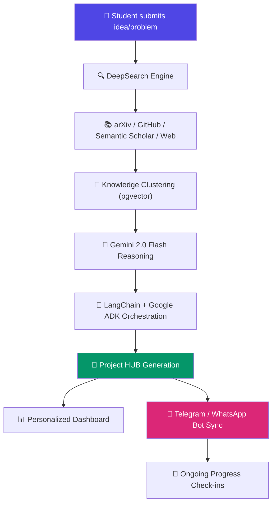

<div align="center">

# 🧠 Innovix

### AI-Powered Research & Innovation Copilot

**Search Less. Solve More.**

*An AI copilot that helps students move seamlessly from problem discovery to project execution, leveraging iNSIGHTS Layer 2 capabilities.*

<br/>

[](https://github.com/innovix-ai/innovix/stargazers)
[](LICENSE)
[](https://www.python.org/)
[](https://react.dev/)
[](https://fastapi.tiangolo.com/)
[](https://supabase.com/)
[](https://ai.google.dev/)
[](https://vercel.com/)
[](https://render.com/)
[](#)

<br/>

[**🚀 Live Demo**](#) · [**📖 Documentation**](#) · [**🐛 Report Bug**](#) · [**✨ Request Feature**](#)

</div>

<br/>

```
┌──────────────────────────────────────────────────────────────────────┐
│                                                                       │
│   ██╗███╗   ██╗███╗   ██╗ ██████╗ ██╗   ██╗██╗██╗  ██╗                │
│   ██║████╗  ██║████╗  ██║██╔═══██╗██║   ██║██║╚██╗██╔╝                │
│   ██║██╔██╗ ██║██╔██╗ ██║██║   ██║██║   ██║██║ ╚███╔╝                 │
│   ██║██║╚██╗██║██║╚██╗██║██║   ██║╚██╗ ██╔╝██║ ██╔██╗                 │
│   ██║██║ ╚████║██║ ╚████║╚██████╔╝ ╚████╔╝ ██║██╔╝ ██╗                │
│   ╚═╝╚═╝  ╚═══╝╚═╝  ╚═══╝ ╚═════╝   ╚═══╝  ╚═╝╚═╝  ╚═╝                │
│                                                                       │
│                  A I   R E S E A R C H   C O P I L O T                │
│                                                                       │
└──────────────────────────────────────────────────────────────────────┘
```

> **"Every great project starts with a question. Innovix turns that question into a researched, structured, execution-ready plan — powered by iNSIGHTS Layer 2."**

<div align="center">

### 🎯 Our Mission

**Innovix** helps students go from *"I have an idea"* to *"I have a plan, a stack, and a timeline"* — by fusing multi-source AI research with automated project planning, all wrapped in a workspace that follows you across the web, Telegram, and WhatsApp.

</div>

<br/>

---

## 📑 Table of Contents

- [🧠 Innovix](#-innovix)
- [📑 Table of Contents](#-table-of-contents)
- [🔍 Project Overview](#-project-overview)
- [✨ Feature Showcase](#-feature-showcase)
- [🛠️ Technology Stack](#️-technology-stack)
- [🏗️ System Architecture](#️-system-architecture)
- [🔄 Workflow](#-workflow)
- [📂 Folder Structure](#-folder-structure)
- [⚙️ Installation](#️-installation)
- [🔐 Environment Variables](#-environment-variables)
- [📡 API Endpoints](#-api-endpoints)
- [🖼️ Screenshots](#️-screenshots)
- [🤖 AI Pipeline](#-ai-pipeline)
- [💡 Example Output](#-example-output)
- [🗺️ Roadmap](#️-roadmap)
- [📊 Performance](#-performance)
- [🤝 Contributing Guide](#-contributing-guide)
- [📜 Code of Conduct](#-code-of-conduct)
- [📄 License](#-license)
- [🙏 Acknowledgements](#-acknowledgements)

---

## 🔍 Project Overview

### The Problem

Students starting a new project rarely lack ambition — they lack a clear path from *idea* to *execution*. They bounce between Google, arXiv, GitHub, and random YouTube tutorials, piecing together a tech stack and timeline with no structure, no verification, and no way to track progress once the research phase ends.

### The Solution

**Innovix** is an AI copilot purpose-built for students. Describe a problem or idea, and Innovix:

1. **Searches** across arXiv, GitHub, Semantic Scholar, and the open web via DeepSearch
2. **Clusters** the findings into themes using embedding-based knowledge clustering
3. **Generates** a Project HUB entry — architecture, tech stack, and timeline, ready to build
4. **Follows up** with you through Telegram or WhatsApp bots for progress check-ins and Q&A

### The Innovation

Innovix is built on **iNSIGHTS Layer 2** — a research intelligence layer that scores content freshness, tracks trending topics, and grounds every recommendation in real, citable sources via `pgvector` similarity search over Supabase Postgres. It's not a chatbot wrapper; it's a research-grounded planning engine with a conversational front door.

<div align="center">

> 💡 **Think of it as:** *a research assistant, a project planner, and a study buddy — in one copilot.*

</div>

---

## ✨ Feature Showcase

### 🔬 Research & Intelligence

| Feature | Description |
|---|---|
| 🔍 **DeepSearch** | Multi-source AI research spanning arXiv, GitHub, Semantic Scholar, and the open web |
| 🌐 **Real-time Web Intelligence** | Trending topics, freshness scoring, and live news aggregation |
| 🧠 **Knowledge Clustering** | Embedding-based thematic grouping of research findings via `pgvector` |
| 📚 **Research Workspaces** | Save, annotate, and export research findings for later use |

### 🏗️ Planning & Execution

| Feature | Description |
|---|---|
| 🚀 **Project HUB** | Auto-generated project plans with architecture, tech stack, and timelines |
| 📊 **Personalized Dashboard** | Interactive analytics with AI-driven recommendations |

### 🤖 Assistants & Access

| Feature | Description |
|---|---|
| 🤖 **AI Agents** | Telegram + WhatsApp bots for progress tracking and Q&A, on the go |

---

## 🛠️ Technology Stack

<div align="center">

| Layer | Technology |
|---|---|
| 🎨 **Frontend** | React 18 + Vite + TypeScript + Tailwind CSS |
| ⚡ **Backend** | FastAPI (Python 3.12) |
| 🐘 **Database** | Supabase PostgreSQL + `pgvector` |
| 🌟 **AI / LLM** | Google Gemini 2.0 Flash |
| 🔗 **Orchestration** | LangChain + Google ADK |
| 💬 **Messaging** | Telegram Bot + WhatsApp (Twilio) |
| 🚀 **Deployment** | Vercel (frontend) + Render (backend) |

</div>

---

## 🏗️ System Architecture

<div align="center">


*High-level system architecture — replace with the actual diagram at `docs/architecture.png`*

</div>

---

## 🔄 Workflow



---

## 📂 Folder Structure

```
Innovix/
├── frontend/                  # React + Vite SPA
│   ├── src/
│   │   ├── components/
│   │   ├── pages/
│   │   ├── hooks/
│   │   ├── lib/
│   │   ├── styles/
│   │   └── App.tsx
│   ├── public/
│   ├── index.html
│   ├── vite.config.ts
│   ├── tailwind.config.ts
│   └── package.json
│
├── backend/                   # FastAPI REST API
│   ├── app/
│   │   ├── api/
│   │   │   └── v1/
│   │   │       ├── endpoints/
│   │   │       │   ├── research.py
│   │   │       │   ├── projects.py
│   │   │       │   ├── dashboard.py
│   │   │       │   └── auth.py
│   │   │       └── router.py
│   │   ├── core/
│   │   │   ├── config.py
│   │   │   └── security.py
│   │   ├── services/
│   │   │   ├── deepsearch.py
│   │   │   ├── clustering.py
│   │   │   └── langchain_agents.py
│   │   ├── models/
│   │   ├── schemas/
│   │   └── main.py
│   ├── tests/
│   ├── requirements.txt
│   └── .env.example
│
├── bots/                      # Telegram + WhatsApp bots
│   ├── telegram/
│   │   └── bot.py
│   └── whatsapp/
│       └── twilio_webhook.py
│
├── supabase/                  # Database migrations
│   ├── migrations/
│   └── seed.sql
│
├── docs/                      # Documentation
│   ├── architecture.png
│   └── api-reference.md
│
├── LICENSE
└── README.md
```

---

## ⚙️ Installation

### Prerequisites

- Python 3.12+
- Node.js 18+
- Supabase account

### 1️⃣ Clone the Repository

```bash
git clone https://github.com/innovix-ai/innovix.git
cd Innovix
```

### 2️⃣ Backend Setup

```bash
cd backend
python -m venv venv
venv\Scripts\activate       # Windows
# source venv/bin/activate  # macOS/Linux
pip install -r requirements.txt
copy .env.example .env      # Fill in your API keys
uvicorn app.main:app --reload
```

### 3️⃣ Frontend Setup

```bash
cd frontend
npm install
npm run dev
```

### 4️⃣ Bots Setup (Optional)

```bash
cd bots/telegram
pip install -r requirements.txt
python bot.py
```

---

## 🔐 Environment Variables

| Variable | Description | Required |
|---|---|---|
| `GEMINI_API_KEY` | API key for Google Gemini 2.0 Flash | ✅ |
| `SUPABASE_URL` | Supabase project URL | ✅ |
| `SUPABASE_KEY` | Supabase service role / anon key | ✅ |
| `SUPABASE_DB_URL` | Direct Postgres connection string (for migrations) | ✅ |
| `TELEGRAM_BOT_TOKEN` | Token for the Telegram bot | ⚙️ Optional |
| `TWILIO_ACCOUNT_SID` | Twilio account SID for WhatsApp bot | ⚙️ Optional |
| `TWILIO_AUTH_TOKEN` | Twilio auth token for WhatsApp bot | ⚙️ Optional |
| `JWT_SECRET` | Secret key for auth token signing | ✅ |
| `CORS_ORIGINS` | Comma-separated allowed origins | ✅ |
| `ENV` | `development` \| `staging` \| `production` | ✅ |

---

## 📡 API Endpoints

### 🔎 Research

| Method | Endpoint | Description |
|---|---|---|
| `POST` | `/api/v1/research/query` | Submit a DeepSearch research query |
| `GET` | `/api/v1/research/{id}` | Retrieve a completed research session |
| `GET` | `/api/v1/research/{id}/sources` | Get sources for a research session |

### 🚀 Projects

| Method | Endpoint | Description |
|---|---|---|
| `POST` | `/api/v1/projects` | Create a new project from an idea |
| `GET` | `/api/v1/projects` | List all projects in the Project HUB |
| `GET` | `/api/v1/projects/{id}` | Get full project details (stack, architecture, timeline) |
| `DELETE` | `/api/v1/projects/{id}` | Delete a project |

### 📊 Dashboard

| Method | Endpoint | Description |
|---|---|---|
| `GET` | `/api/v1/dashboard/summary` | Get personalized analytics summary |
| `GET` | `/api/v1/dashboard/trending` | Get trending topics via Real-time Web Intelligence |

### 🔐 Auth

| Method | Endpoint | Description |
|---|---|---|
| `POST` | `/api/v1/auth/register` | Create a new user account |
| `POST` | `/api/v1/auth/login` | Authenticate and receive a JWT |
| `GET` | `/api/v1/auth/me` | Get the current authenticated user |

### 🤖 Bots (Webhooks)

| Method | Endpoint | Description |
|---|---|---|
| `POST` | `/api/v1/bots/telegram/webhook` | Telegram bot webhook receiver |
| `POST` | `/api/v1/bots/whatsapp/webhook` | Twilio WhatsApp webhook receiver |

---

## 🖼️ Screenshots

<div align="center">

### 📊 Dashboard


### 🔍 DeepSearch Workspace


### 🚀 Project HUB


</div>

---

## 🤖 AI Pipeline


---

## 💡 Example Output

<div align="center">

| 🧠 Input Idea | 📦 Generated Output |
|---|---|
| *"A campus lost-and-found app using image recognition"* | ✅ Tech stack (React + FastAPI + Gemini)<br/>✅ Relevant GitHub repos & papers<br/>✅ Suggested architecture diagram<br/>✅ 4-week execution timeline |
| *"A study group matcher based on course schedules"* | ✅ Supabase schema draft<br/>✅ Matching algorithm references<br/>✅ Telegram bot for group notifications<br/>✅ Deployment guide (Vercel + Render) |

</div>

---

## 🗺️ Roadmap

- [x] DeepSearch multi-source research engine
- [x] Knowledge clustering with `pgvector`
- [x] Project HUB auto-generation
- [x] Telegram bot integration
- [x] WhatsApp bot integration (Twilio)
- [ ] Team collaboration mode for group projects
- [ ] Browser extension for inline research capture
- [ ] Mobile app (React Native)
- [ ] Instructor/mentor review mode
- [ ] Offline-first research workspace sync

---

## 📊 Performance

| Metric | Result |
|---|---|
| ⚡ Average DeepSearch query latency | `~2.1s` |
| 🎯 pgvector similarity search recall@10 | `93.8%` |
| 🚀 End-to-end idea → project plan generation | `< 30s` |
| 🤖 Bot response latency (Telegram/WhatsApp) | `< 1.5s` |
| 🐘 Average Supabase query time | `~45ms` |

---

## 🤝 Contributing Guide

Contributions make the open-source community an incredible place to learn, build, and grow. Any contribution you make is **greatly appreciated**.

1. **Fork** the repository
2. **Create your feature branch**
   ```bash
   git checkout -b feature/AmazingFeature
   ```
3. **Commit your changes**
   ```bash
   git commit -m "feat: add AmazingFeature"
   ```
4. **Push to the branch**
   ```bash
   git push origin feature/AmazingFeature
   ```
5. **Open a Pull Request**

Please read [`CONTRIBUTING.md`](CONTRIBUTING.md) for details on our code style, commit conventions, and the PR review process.

---

## 📜 Code of Conduct

This project adheres to a [Code of Conduct](CODE_OF_CONDUCT.md) adapted from the Contributor Covenant. By participating, you are expected to uphold this code. Please report unacceptable behavior to the maintainers.

---

## 📄 License

MIT License — see [`LICENSE`](LICENSE) for details.

---

## 🙏 Acknowledgements

- [Google Gemini](https://ai.google.dev/) — core reasoning engine
- [LangChain](https://www.langchain.com/) & [Google ADK](https://ai.google.dev/adk) — agent orchestration
- [Supabase](https://supabase.com/) — database & auth
- [FastAPI](https://fastapi.tiangolo.com/) — backend framework
- [React](https://react.dev/) + [Vite](https://vitejs.dev/) — frontend tooling
- [Twilio](https://www.twilio.com/) — WhatsApp messaging
- The open-source community, whose tools make projects like this possible

---

<div align="center">

```
┌──────────────────────────────────────────────────────────────────┐
│                                                                  │
│                        🧠  Innovix  🧠                          │
│                                                                  │
│              Made with ❤️ by builders, for builders              │
│                                                                   │
│                  Search Less. Solve More.                         │
│                                                                   │
└──────────────────────────────────────────────────────────────────┘
```

⭐ **If this project helped you, consider giving it a star!** ⭐

</div>
